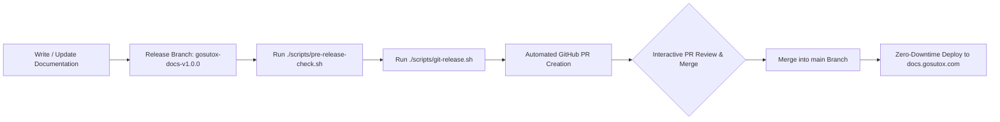

# Gōsuto X & AXON Official Documentation Center

```
========================================================================================
   GOSUTOX & AXON OFFICIAL DOCUMENTATION CENTER (DOCS.GOSUTOX.COM) - VERSION 1.0.0
========================================================================================
```

Official Docs-as-Code repository powering [docs.gosutox.com](https://docs.gosutox.com). Built with Mintlify, modern MDX components, and styled to match the GosutoX Navy Mirage enterprise design system.

---

## 1. Documentation Structure & Taxonomy

```
gosutox-docs/
├── .agents/
│   └── AGENTS.md                  # Constitutional governance & AI agent standards
├── scripts/
│   ├── pre-release-check.sh       # Automated pre-release quality & link audit gate
│   └── git-release.sh             # Automated release, tagging & GitHub PR generator
├── get-started/                   # Onboarding, quickstart, and AI² philosophy
├── talk/                          # AXON Talk (Real-time voice & streaming channels)
├── symposium/                     # AXON Symposium (Multi-agent debates & consensus)
├── studio/                        # AXON Studio (Prompt engineering & workflow canvas)
├── coworx/                        # AXON Coworx (Human-AI collaborative workspace)
├── data/                          # AXON Data (Vector search, episodic memory & Lakehouse)
├── agent/                         # Autonomous agents & multi-channel tools
├── brains/                        # Specialized enterprise AI brain engines
├── trust/                         # Security, privacy (PIPA/GDPR/CCPA) & compliance
├── changelog/                     # Platform version release notes & changelogs
├── logo/                          # Light & dark mode vector brand assets
├── docs.json                      # Mintlify v2 navigation & styling SSOT
├── mint.json                      # Mintlify v1 compatibility navigation schema
├── style.css                      # Custom Navy Mirage theme styling
├── VERSION                        # Single Source of Truth (SSOT) release version
└── README.md                      # Project overview & deployment guidelines
```

---

## 2. Local Preview & Development

To preview the documentation locally with hot reloading:

```bash
# Install Mintlify CLI (if not installed)
npm i -g mintlify

# Start local preview server (defaults to localhost:3000)
mintlify dev

# Audit for broken internal/external links
mintlify broken-links
```

---

## 3. Release & Deployment Guidelines

All documentation updates are governed by the **Double-PR GitOps & HITL Approval Standard**. Direct pushes to `main` are strictly prohibited.



### Step 1: Version Alignment & Working Branch
Always ensure the root `VERSION` file reflects the target release version. Work on the dedicated release branch:
```bash
git checkout -b gosutox-docs-v$(cat VERSION)
```

### Step 2: Automated Pre-Release Quality Audit
Before committing, run the pre-release quality gate:
```bash
./scripts/pre-release-check.sh
```
This script automatically verifies:
- `VERSION` file presence and non-empty state
- `docs.json` and `mint.json` valid JSON syntax
- 100% existence of all pages referenced in the navigation taxonomy
- Branding assets (`favicon.ico`, `logo/`) and `style.css` integrity

### Step 3: Execute Release & Auto-Generate PR
Run the automated release script with a descriptive commit message:
```bash
./scripts/git-release.sh "feat(docs): update 1.0.0 architecture guides and release notes"
```
The script will:
1. Re-run `./scripts/pre-release-check.sh`
2. Stage and commit all changes
3. Tag the release (`gosutox-docs-v{VERSION}`)
4. Push the release branch and tag to `origin`
5. Automatically create a **GitHub Pull Request** targeting `main`
6. Output the clickable PR review link in terminal/chat

### Step 4: Human-in-the-Loop Review & Merge
1. Click the PR link provided in chat.
2. Review the documentation diffs.
3. Click **Merge pull request** to merge into `main`.
4. Mintlify hosting automatically deploys the updated documentation to **[docs.gosutox.com](https://docs.gosutox.com)** within seconds.

---

## 4. Governance & Style Policies

- **Single Source of Truth**: All page additions or removals MUST be reflected in `docs.json`.
- **Zero Orphaned Pages**: Every MDX file must be linked within the navigation schema.
- **Dual-Theme Fidelity**: Ensure all images and code snippets render cleanly across Light and Dark themes.
- **Docs-as-Code**: Treat documentation changes with the same engineering rigor as production code.
