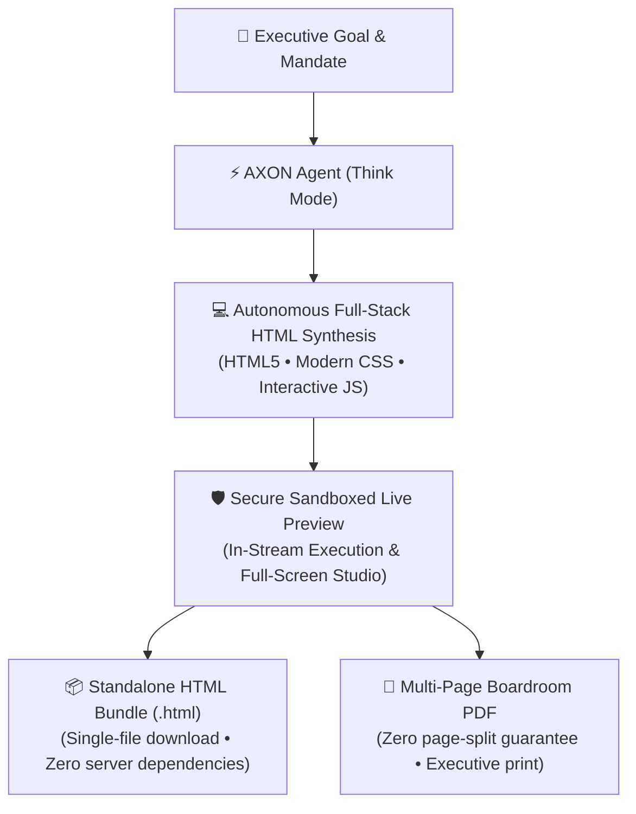

## Beyond Plain Text: Production-Ready HTML Artifacts

Traditional AI assistants restrict deliverables to static markdown text trapped inside ephemeral chat bubbles. 

**AXON Agent** transforms conversational intelligence into **standalone, interactive HTML artifacts and boardroom documents**. With zero external build dependencies, AXON writes fully self-contained HTML applications complete with embedded styles, modern responsive layouts, and interactive JavaScript.

---

## 4 Core Enterprise Artifact Categories

<CardGroup cols={2}>
  <Card title="Executive Keynote & Slide Decks" icon="presentation">
    Full-screen slide presentations with arrow key navigation (`←` / `→`), smooth slide transitions, and paired Light/Dark theme support.
  </Card>
  <Card title="Interactive Financial ROI Models" icon="calculator">
    Dynamic financial calculators with interactive sliders, discount rate adjusters, sensitivity tables, and instant chart re-rendering.
  </Card>
  <Card title="Strategy Roadmaps & Gantt Timelines" icon="timeline">
    Milestone tracking dashboards with clickable phase dependencies, critical path indicators, and departmental ownership badges.
  </Card>
  <Card title="Boardroom Performance Dashboards" icon="chart-mixed">
    Comprehensive KPI scorecards featuring high-density data tables, metric gauges, and executive summary callouts.
  </Card>
</CardGroup>

---

## Concrete "Aha!" Scenario: Interactive SaaS Pricing Calculator

Imagine you need to present three new subscription pricing models to your board of directors:

> **The Executive Challenge**:
> *"We need a visual, interactive calculator that lets board members adjust our average contract value (ACV) and churn rate to dynamically project 3-year ARR and gross margins."*

### How AXON Executes the Mandate

<Steps>
  <Step title="Goal Submission">
    Submit your strategic prompt in **Think Mode**: *"Generate a standalone interactive HTML calculator for our Series B board meeting. Include interactive sliders for Monthly Churn (1% to 5%) and ACV ($10k to $100k), dynamic ARR projections, and a clean executive theme."*
  </Step>

  <Step title="Autonomous Code Generation & Sandboxed Preview">
    AXON synthesizes the complete HTML application in seconds and immediately mounts it in a secure, sandboxed live preview within your chat stream.
  </Step>

  <Step title="Live In-Stream Interaction">
    Interact with the sliders directly inside the conversation thread—watch formulas recalculate and charts animate in real time without leaving AXON.
  </Step>

  <Step title="Export & Distribution">
    Click **Download HTML** to receive a single, lightweight `.html` file that anyone can open in Chrome, Safari, or Edge without needing an AXON account or server setup.
  </Step>
</Steps>

---

## The Power of Standalone HTML Bundles

Every HTML deliverable generated by AXON adheres to the **Zero-Dependency Single-File Standard**:

| Architecture Feature | Implementation Standard | Enterprise Benefit |
| :--- | :--- | :--- |
| **Self-Contained Bundling** | CSS, SVGs, and JavaScript embedded inline | No broken asset links or external CDN tracking |
| **Zero Server Requirements** | Runs completely client-side in any modern browser | Distribute securely via email, Slack, or USB drives |
| **Air-Gapped & Offline Ready** | Functions perfectly without an active internet connection | Ideal for classified, offline, or flight presentations |
| **Cross-Platform Parity** | Fully responsive across macOS, Windows, iOS, Android | Looks identical on boardroom projectors and iPad screens |

---

## Seamless Document Studio Integration

Click the **Open in Document Studio** icon on any generated artifact to access executive publishing controls:

* **Split-Screen Code & Preview**: Inspect the underlying clean HTML5 source code side-by-side with the live rendering.
* **Pixel-Perfect PDF Print Engine**: Generates multi-page executive PDFs with `@media print` rules, ensuring tables, charts, and diagrams are never awkwardly severed across page breaks.
* **Corporate Header & Watermarking**: Automatically applies date stamps, confidentiality banners, and document version metadata.

---

## Next Steps

<CardGroup cols={2}>
  <Card title="Document Studio & Viewer" icon="window-maximize" href="/studio/document-viewer">
    Deep-dive into full-screen artifact editing, layout customization, and live document preview.
  </Card>
  <Card title="Pixel-Perfect PDF Printing" icon="file-pdf" href="/studio/pdf-printing-engine">
    Learn how AXON's two-pass print engine guarantees zero page-split truncation on multi-page reports.
  </Card>
</CardGroup>
