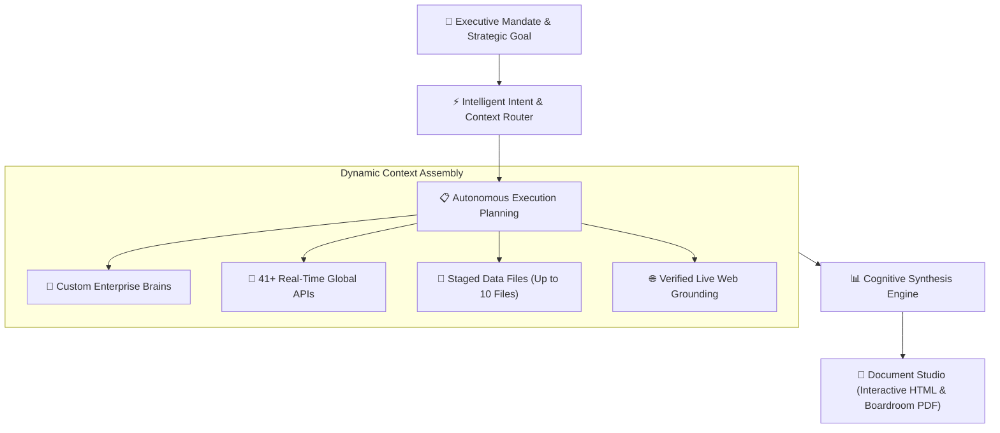

## The Central Cognitive Heart

**AXON Agent** is the flagship cognitive engine of the AXON Operating System. Unlike traditional chatbots that merely generate conversational text, AXON Agent functions as an autonomous strategic partner—decomposing complex enterprise mandates into deterministic execution steps, orchestrating external tools, and assembling boardroom-ready deliverables.

---

## Executive Workflow Architecture

---

## The 4-Stage Execution Cycle

Every conversation turn in AXON Agent follows a structured, deterministic 4-stage execution cycle:

<Steps>
  <Step title="Goal Formulation & Strategy Alignment">
    The user submits a high-level strategic objective in plain language. AXON automatically parses the core intent, scope, and required domain heuristics without requiring prompt engineering.
  </Step>

  <Step title="Dynamic Multi-Context Activation">
    Based on the user's active toggles in the Right Context Tools Panel, AXON selectively queries:
    * **Proprietary Brains** for internal heuristics, organizational taxonomies, and corporate policies.
    * **41+ Live Regulatory & Financial APIs** for live SEC, DART, FRED, and market disclosures.
    * **Multimodal Data Files** (up to 10 files) for spreadsheets, slide decks, and technical specifications.
  </Step>

  <Step title="Reasoning & Transparent Grounding">
    AXON synthesizes all retrieved data points through your chosen reasoning mode:
    * **Flash Mode**: High-velocity direct response for rapid operational execution.
    * **Think Mode**: Deep multi-step reasoning with transparent, collapsible thinking blocks.
    * **Factual Grounding**: Every metric and assertion is strictly cited with clickable `[ref:Source]` badges.
  </Step>

  <Step title="Executive Artifact Assembly & Publishing">
    The finalized output is streamed in fluid 60 FPS and packaged for immediate corporate distribution via **Document Studio**:
    * **Download HTML**: Standalone, single-file interactive web application bundle.
    * **Export PDF**: Multi-page boardroom document with zero page-split truncation.
  </Step>
</Steps>

---

## Core Enterprise Capabilities

| Capability | User Workflow | Business & Operational Value |
| :--- | :--- | :--- |
| **1-Turn Symphony** | Select Brains, APIs, and Files in the Right Tools Panel | Cross-examines proprietary spreadsheets against live market filings in 1 prompt turn |
| **Dynamic Thinking Trace** | Expand the "Thinking Process" block in the stream | Complete transparency into how hypotheses were evaluated before final delivery |
| **Verified Source Badges** | Click any `[ref:Source]` citation tag | Instantly trace claims to official SEC filings, DART disclosures, or uploaded files |
| **Resilient Fallback** | Automated live web grounding fallback | Uninterrupted operational continuity even during third-party API turbulence |
| **Zero Token Waste** | Targeted context channel activation | Eliminates bloated context loops, ensuring 100% mathematical billing precision |

---

## Explore the AXON Agent Sub-Chapters

<CardGroup cols={2}>
  <Card title="Sessions & Custom Folders" icon="folder-tree" href="/agent/sessions-and-folders">
    Organize conversations into nested, color-coded project folders with instant search.
  </Card>
  <Card title="Reasoning Modes: Flash vs. Think" icon="lightbulb" href="/agent/reasoning-modes">
    Master when to use instant sub-second Flash mode versus deep multi-step Think mode.
  </Card>
  <Card title="1-Turn Tool Symphony" icon="sliders" href="/agent/tools-orchestration">
    Learn how to bind custom Brains, 41+ live APIs, and 10 data files simultaneously.
  </Card>
  <Card title="Code & HTML Artifact Generation" icon="code" href="/agent/code-generation-html">
    Generate interactive web tools, calculations, and standalone visualizations in real time.
  </Card>
</CardGroup>
