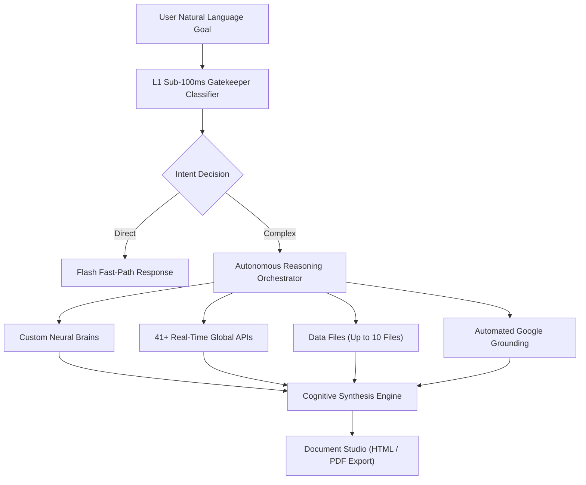

## What is AXON Agent?

**AXON Agent** is the central flagship engine of the AXON Cognitive OS. It serves as an autonomous cognitive partner capable of receiving high-level complex tasks, decomposing them into sequential sub-tasks, querying external tools, and delivering boardroom-ready outcomes.

### Core Architecture

### Key Capabilities
* **Dynamic L1 Gatekeeper**: Evaluates incoming queries in sub-100ms to determine required context sources.
* **Zero Token Waste**: Only activates tools and context channels strictly necessary for the query.
* **Transparent Contingency Fallback**: If an external API is momentarily unreachable, AXON automatically triggers Google Search verification and discloses the contingency banner.
