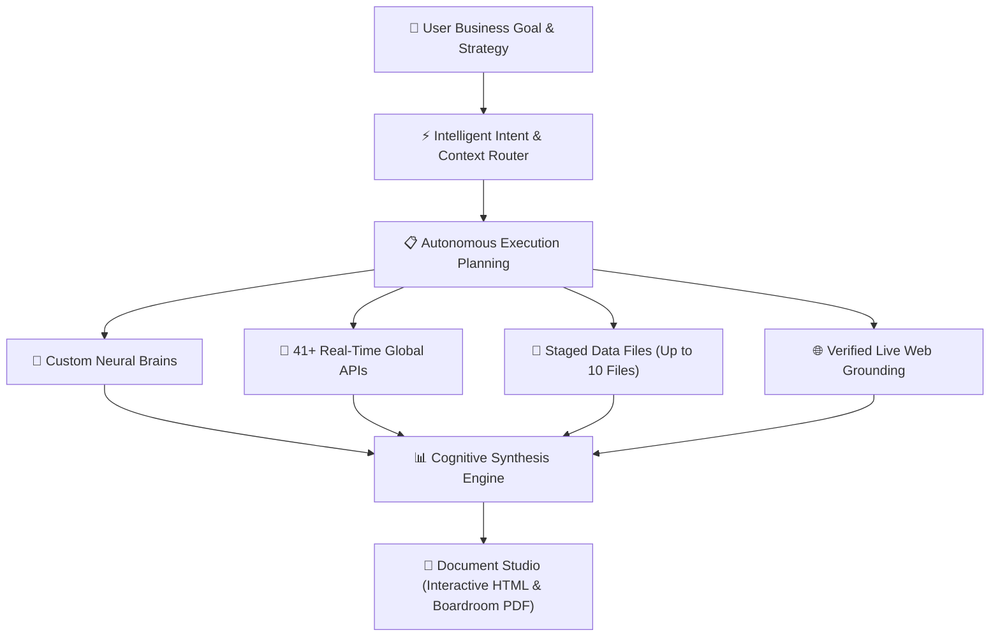

## What is AXON Agent?

**AXON Agent** is the central cognitive engine of the AXON Universal Operating System. It serves as an autonomous strategic partner capable of processing high-level business goals, formulating deterministic execution plans, orchestrating external tools, and delivering boardroom-ready documents.

### Executive Workflow Architecture

### Core Enterprise Strengths
* **Adaptive Context Orchestration**: Automatically identifies and coordinates the exact combination of internal brains, live APIs, and files required for the task.
* **Zero Token Waste**: Eliminates bloated context loops by selectively engaging only verified data channels.
* **Transparent Grounding Guarantee**: Every factual claim is rigorously grounded with explicit source citations (`[ref:Source]`).
* **Resilient Contingency Policy**: If a primary data source experiences network turbulence, AXON automatically performs verified fallback retrieval while clearly disclosing the source.
