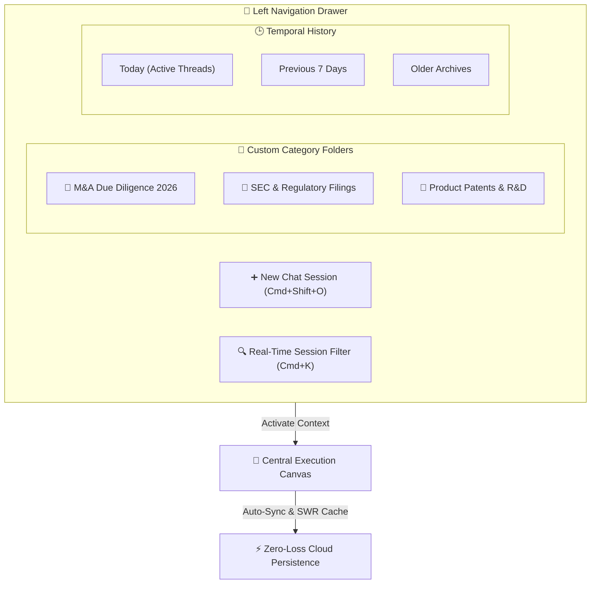

## Enterprise Session Governance

In mission-critical research and executive analysis, managing historical context and past conversation threads is as vital as the analysis itself. AXON's **Left Navigation Drawer** delivers an intuitive, high-density session governance system designed to organize hundreds of strategic threads without cognitive friction.

---

## Key Capabilities of the Left Navigation Drawer

<CardGroup cols={3}>
  <Card title="Custom Category Folders" icon="folder-plus">
    Group conversations by strategic project, legal matter, or department with custom color-coded folder tags.
  </Card>
  <Card title="Instant Keyword Search" icon="magnifying-glass">
    Locate historical conversations, specific data points, or attached Brain IDs instantly with sub-millisecond filtering (`Cmd + K`).
  </Card>
  <Card title="Zero-Loss Persistence" icon="cloud-arrow-up">
    Session states, active thinking traces, and background research tasks automatically survive page refreshes and device reboots.
  </Card>
</CardGroup>

---

## 1. Custom Category Folders & Lifecycle

Folders allow teams and individual executives to insulate unrelated research projects into clean, isolated workspaces.

### Managing Project Folders

* **Create New Folder**: Click the **Folder+** icon at the top of the Left Drawer, enter a folder title (e.g., *Q4 Financial Audit*), and assign an optional color accent.
* **Assigning Sessions to Folders**:
  1. Hover over any conversation item in the session list.
  2. Click the **Move Folder** icon (`FolderInput`).
  3. Select the target project folder from the interactive dropdown.
* **Accordion Expand / Collapse**: Click the folder chevron to collapse or expand project clusters, keeping your workspace uncluttered.
* **Folder Renaming & Deletion**: Rename folders anytime or delete them with full safety guards—deleting a folder does **not** delete its contained chat sessions unless explicitly confirmed.

---

## 2. Instant Session Search & Temporal Grouping

AXON automatically categorizes unfiled sessions into chronological tiers to ensure immediate access to recent work:

| Temporal Section | Content Scope | Operational Use Case |
| :--- | :--- | :--- |
| **Today** | Sessions created or active during the current day | Real-time ongoing research threads and active deliverables |
| **Previous 7 Days** | Active conversations from the past week | Weekly progress reviews and active client proposals |
| **Older** | Historical conversation archives | Long-term reference materials, precedent analyses, and historical audits |

<Tip>
**Global Keyboard Search (`Cmd + K`)**: Press `Cmd + K` from anywhere in the application to instantly focus the session search bar. Type any keyword to filter session titles and timestamps in real time.
</Tip>

---

## 3. Session Actions & Inline Governance

Each conversation session in the Left Drawer provides rapid inline governance controls accessible upon hover:

<AccordionGroup>
  <Accordion title="✏️ Inline Title Renaming" icon="pen-to-square">
    By default, AXON automatically generates an intelligent, concise title based on your initial prompt. To customize it, hover over the session, click the **Edit** icon, enter your desired milestone title (e.g., *Valuation Model v3.2 (Approved)*), and press `Enter`.
  </Accordion>

  <Accordion title="📂 Move to Category Folder" icon="folder-tree">
    Reorganize active conversations into specialized folders at any point during your workflow without disrupting ongoing AI streaming or active tool calls.
  </Accordion>

  <Accordion title="🗑️ Safe Session Deletion with Optimistic Rollback" icon="trash-can">
    Deleting a session removes all associated chat turns and reasoning traces. AXON executes an **optimistic UI deletion** (<10ms) backed by an atomic snapshot rollback guard—if a network error occurs, the session is seamlessly restored without data loss.
  </Accordion>
</AccordionGroup>

---

## 4. Zero-Loss Session Persistence

AXON eliminates the anxiety of lost AI conversations through multi-layer client and server synchronization:

* **SWR Cache & Deduplication**: Conversation lists are cached locally with background revalidation, providing instantaneous rendering with zero loading flicker upon revisiting.
* **Background Task Synchronization**: If an autonomous research task is running in the background while you switch sessions, the Left Drawer displays an active processing indicator (`⚡ Task Monitor`), ensuring visibility across parallel research tracks.
* **Cross-Device Context Resumption**: Log in from any workstation or laptop to find all session titles, folder hierarchies, and message histories preserved with cryptographic legal residency isolation (`KR / US`).

---

## Essential Keyboard Shortcuts

| Shortcut | Action | Scope |
| :--- | :--- | :--- |
| `Cmd + Shift + O` | **Start New Conversation** | Instantly resets context and opens an unpolluted thread |
| `Cmd + K` | **Focus Session Search** | Highlights the search filter for rapid keyword lookup |
| `Cmd + /` | **Toggle Left Sidebar** | Collapses sidebar for a full-width distraction-free canvas |
| `Enter` | **Save Inline Rename** | Confirms session or folder title edit |
| `Escape` | **Cancel Inline Action** | Dismisses rename input or search query |

---

## Next Steps

<CardGroup cols={2}>
  <Card title="Reasoning Modes: Flash vs. Think" icon="lightbulb" href="/agent/reasoning-modes">
    Understand how session context is processed differently across instant Flash Mode and deep Think Mode.
  </Card>
  <Card title="1-Turn Tool Symphony" icon="sliders" href="/agent/tools-orchestration">
    Learn how to attach Brains, live APIs, and up to 10 data files directly into your active session turn.
  </Card>
</CardGroup>
