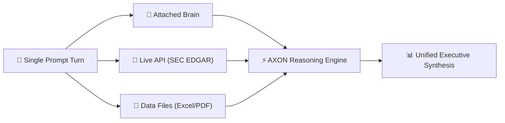

## The 1-Turn Symphony Concept

The true power of AXON Agent lies in combining multiple isolated data dimensions into a single prompt turn:

<CardGroup cols={3}>
  <Card title="🧠 Attached Brain" icon="brain">
    **Corporate Strategy Brain**
    Ingests proprietary schemas, terminology, and internal heuristics.
  </Card>
  <Card title="📡 Active Live API" icon="signal">
    **SEC EDGAR 10-K Connector**
    Streams live official financial filings and regulatory disclosures.
  </Card>
  <Card title="📁 Attached Files" icon="folder-open">
    **Financial Model & Patent.pdf**
    Extracts raw figures and claims with zero OCR hallucination.
  </Card>
</CardGroup>

### Execution Flow in 1 Turn
1. **Brain Extraction**: Ingests your corporate personas, proprietary terminology, and evaluation rules.
2. **API Retrieval**: Pulls live 10-K filings directly from the SEC EDGAR database.
3. **File Multimodal Ingestion**: Parses your internal Excel financial model and PDF patent claims.
4. **Unified Synthesis**: Emits an executive report comparing internal metrics against live external data with 100% mathematical precision.
