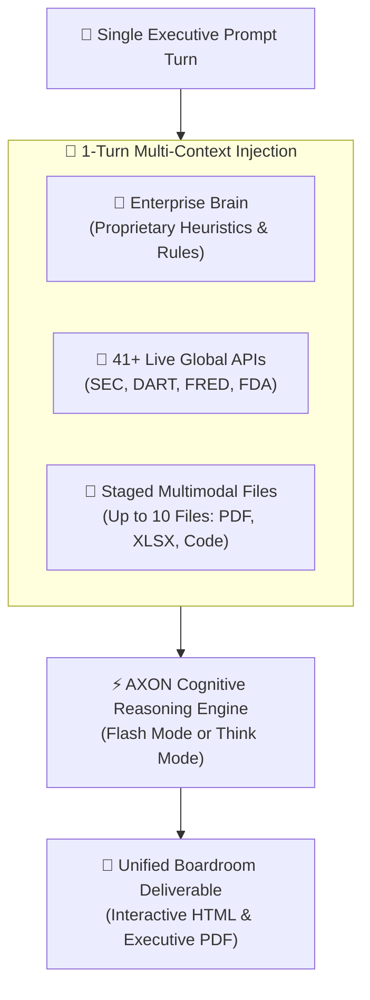

## The 1-Turn Symphony Paradigm

Traditional AI systems force users into fragmented, multi-step prompting loops: first uploading a file, then asking for a summary, then separately searching the web, and finally attempting to manually assemble a report.

**AXON's 1-Turn Symphony** fundamentally changes this workflow. In the **Right Context Tools Panel**, you can bind three distinct intelligence dimensions simultaneously into a single prompt turn:

---

## The 3 Intelligence Dimensions

<CardGroup cols={3}>
  <Card title="1. Enterprise Brains" icon="brain">
    **Internal Heuristics & Rules**
    Injects organizational personas, legal evaluation criteria, and corporate terminology into the reasoning loop.
  </Card>
  <Card title="2. 41+ Live APIs" icon="tower-broadcast">
    **Real-Time External Ground Truth**
    Streams authoritative financial disclosures, macroeconomic indexes, and regulatory databases directly.
  </Card>
  <Card title="3. Multimodal Staging Vault" icon="folder-open">
    **Proprietary Internal Data**
    Stages up to 10 files (financial models, patent claims, architecture blueprints) with zero OCR loss.
  </Card>
</CardGroup>

---

## Concrete "Aha!" Scenario: Cross-Border M&A Audit in 1 Turn

Imagine you are an executive evaluating an acquisition of a biomedical technology company:

> **The Executive Challenge**:
> *"We need to compare the target company's internal valuation model against live market comps, cross-check their primary patent claims against active FDA approvals, and format the final evaluation according to our corporate M&A evaluation guidelines."*

### How to Execute in 1 Turn

<Steps>
  <Step title="Attach the M&A Governance Brain">
    In the Right Panel, select your **Corporate M&A Due Diligence Brain**. This automatically injects your firm's strict hurdle rates, risk tolerance heuristics, and legal formatting standards.
  </Step>

  <Step title="Activate Live Regulatory Feeds">
    Check the toggles for **SEC EDGAR** (for US public peers) and **FDA 510(k) Approvals** (for medical device clearance status).
  </Step>

  <Step title="Stage 3 Proprietary Data Files">
    Select from your Data Files vault:
    * `Target_Valuation_Model_2026.xlsx` (Cap table and discounted cash flow)
    * `Core_Device_Patent_Claims.pdf` (Baked from original patent deck)
    * `Audited_Financial_Statement.pdf` (Multi-year balance sheets)
  </Step>

  <Step title="Submit 1 Strategic Prompt">
    Enter your prompt: *"Cross-examine the target's DCF growth assumptions against current peer filings, verify patent regulatory clearance against FDA live records, and produce an executive risk score."*
  </Step>
</Steps>

### The 1-Turn Deliverable Result
Within seconds, AXON emits a boardroom-grade comparative audit in **Document Studio**:
* **Financial Parity**: Recomputes spreadsheet DCF multiples and cross-examines them against live peer ratios from SEC EDGAR.
* **Regulatory Clearance**: Verifies specific patent claim numbers against official FDA 510(k) database entries.
* **Transparent Grounding**: Every sentence is backed by interactive citations: `[ref:Target_Valuation_Model_2026.xlsx]`, `[ref:SEC EDGAR: MDT]`, and `[ref:FDA 510(k): K240189]`.

---

## 41+ Verified Live API Channels

AXON connects directly to global regulatory and market data providers without requiring custom webhook coding:

| Category | Real-Time Feeds | Data Attributes |
| :--- | :--- | :--- |
| **Corporate Filings** | SEC EDGAR, Korea DART | 10-K, 10-Q, 8-K, Registration Statements, Annual Reports |
| **Financial & Macro** | FRED, Yahoo Finance, Alpha Vantage | FX Rates, Treasury Yields, Inflation Indices, Stock Comps |
| **Regulatory & Legal** | FDA Approvals, USPTO, EPA, FCC | Drug pipeline clearances, patent registrations, environmental filings |
| **Scientific Literature** | ArXiv, PubMed, Semantic Scholar | Biomedical clinical trials, AI preprints, peer-reviewed journals |
| **Crypto & Digital Assets** | CoinGecko, On-Chain Explorers | Real-time token pricing, liquidity metrics, protocol data |

---

## Multimodal File Staging Rules

* **10-File Limit per Turn**: Select up to 10 files across diverse categories (e.g., 2 PDFs + 1 Excel spreadsheet + 3 source code files + 1 architecture diagram).
* **Supported Formats**:
  * **Documents**: `PDF`, `TXT`, `MD`, `MDX`, `HTML` *(Word, PowerPoint, and Hangul files must be baked to `PDF` before upload)*.
  * **Spreadsheets**: `XLSX`, `XLS`, `CSV`, `TSV`, `PARQUET`.
  * **Code & Config**: `PY`, `JS`, `TS`, `TSX`, `JSON`, `YAML`, `SQL`, `SH`, `XML`.
  * **Images & Audio**: `PNG`, `JPG`, `WEBP`, `MP3`, `WAV`, `MP4`.
* **Zero OCR Hallucination**: Tabular spreadsheets and vector PDFs are parsed directly into memory with zero character distortion.

---

## Next Steps

<CardGroup cols={2}>
  <Card title="Code & HTML Artifact Generation" icon="code" href="/agent/code-generation-html">
    See how 1-turn symphony outputs can generate standalone interactive web dashboards and calculators.
  </Card>
  <Card title="Document Studio & PDF Export" icon="file-pdf" href="/studio/document-viewer">
    Learn how to preview, customize, and export executive PDF reports from your 1-turn analyses.
  </Card>
</CardGroup>
