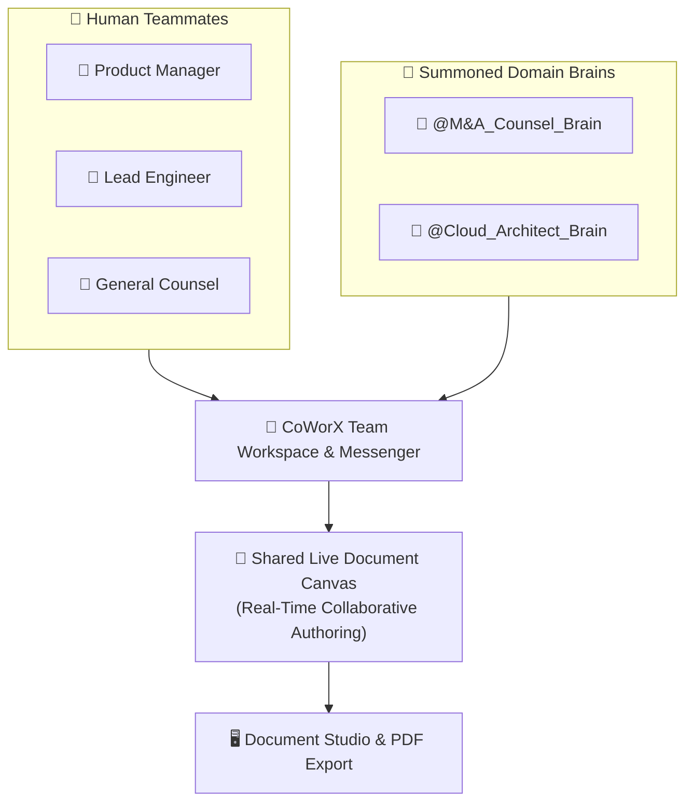

## Fusing Human Teams with AI Brain Agents

In modern enterprise workflows, knowledge work is inherently collaborative. Yet, traditional AI tools remain isolated in single-user chat windows, forcing employees to copy-paste AI outputs back and forth into team messaging apps.

**AXON CoWorX** eliminates this friction. It is a unified collaborative workspace where human colleagues and specialized AI Brains collaborate side-by-side in real-time team channels, co-authoring living documents on a shared canvas:



---

## 4 Core Pillars of AXON CoWorX

<CardGroup cols={2}>
  <Card title="Multi-User Team Channels" icon="comments">
    Create public department channels and private executive project rooms with sub-millisecond WebSocket messaging.
  </Card>
  <Card title="Instant @Mention Brain Summoning" icon="at">
    Type `@` in any channel to bring specialized AI Brains (e.g., `@Tax_Auditor`, `@IP_Counsel`) directly into the team discussion.
  </Card>
  <Card title="Shared Live Document Canvas" icon="pen-to-square">
    A split-screen living editor where humans and AI agents simultaneously write, format tables, and assemble deliverables.
  </Card>
  <Card title="Enterprise Role Governance (ABAC)" icon="shield-check">
    Attribute-based access control protecting sensitive financial data, executive compensation channels, and proprietary IP assets.
  </Card>
</CardGroup>

---

## Anatomy of the CoWorX Workspace

CoWorX is engineered around an ergonomic 3-pane collaborative layout:

```
┌─────────────────┬──────────────────────────────────┬─────────────────┐
│ 📁 Channels     │ 💬 Team Message Stream           │ 📄 Live Canvas  │
│ # general       │ [10:14] Alice: @Tax_Lead review  │ # Series B Term │
│ # project-alpha │ [10:14] 🤖 Tax_Lead: Audited...  │ • Valuation: 85M│
│ 🔒 exec-m&a     │ [10:15] Bob: Updated section 3.  │ • Escrow: 15%   │
└─────────────────┴──────────────────────────────────┴─────────────────┘
```

<Tabs>
  <Tab title="1. Left Channel Sidebar">
    * **Categorized Channels**: Public channels, private project rooms, and direct 1-on-1 team chats.
    * **Unread Indicators & Badges**: Real-time activity notifications and unread message counters.
    * **Channel Management**: One-click channel creation, member invitations, and folder categorization.
  </Tab>

  <Tab title="2. Central Team Messenger">
    * **Sub-16ms Stream**: Fluid streaming discussion with typing indicators and member avatars.
    * **Interactive Mention Popover**: Smart autocompletion for team members (`@Alice`) and domain Brains (`@Patent_Litigator`).
    * **Rich Media & File Drops**: Drag-and-drop spreadsheets, PDFs, and code snippets directly into the thread.
  </Tab>

  <Tab title="3. Right Collaborative Canvas">
    * **Live Document Workspace**: Split-view document editor supporting Markdown, formatted tables, and interactive code blocks.
    * **Agent-Assisted Drafting**: Command summoned Brains to write clauses, populate comparison matrices, and update sections directly on the canvas.
    * **Export Controls**: One-click publishing to **Document Studio** for standalone HTML bundles and executive PDF printing.
  </Tab>
</Tabs>

---

## Concrete "Aha!" Scenario: Drafting an RFP Response in 15 Minutes

> **Team**: Product Lead (Alice), Security Lead (Bob), and `@Compliance_Brain`.

1. **Alice** posts the customer's RFP questionnaire into `#rfp-project-phoenix`.
2. **Bob** types: *"@Compliance_Brain, populate the SOC 2 Type II and GDPR data residency sections based on our latest cloud audit report."*
3. **`@Compliance_Brain`** reads the attached audit PDF and instantly writes the compliance responses directly onto the **Right Live Canvas**.
4. **Alice** and **Bob** review the text, make final executive edits, and click **Export PDF** to generate a client-ready boardroom deliverable.

---

## Explore the CoWorX Sub-Chapters

<CardGroup cols={3}>
  <Card title="Summoning Personal Brain Agents" icon="at" href="/coworx/summoning-personal-brains">
    Learn how to mention and activate specialized AI teammates in group channels.
  </Card>
  <Card title="Live Canvas Document Authoring" icon="pen-nib" href="/coworx/live-canvas-authoring">
    Master real-time co-authoring between human team members and AI Brains.
  </Card>
  <Card title="Team & Workspace Management" icon="users-gear" href="/coworx/team-workspace-management">
    Configure channel access permissions, member roles, and compliance audit logs.
  </Card>
</CardGroup>
