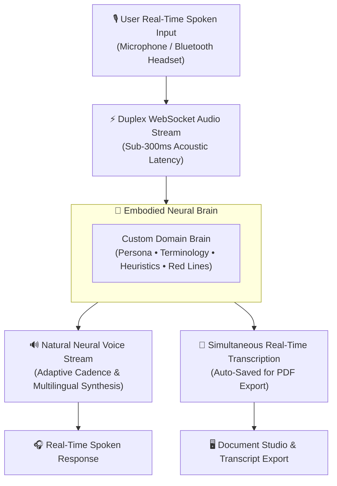

## Beyond Generic Voice Bots: Brain-Embodied Intelligence

Generic voice assistants are limited to reading pre-canned answers with mechanical cadence and severe latency lag.

**AXON Talk** introduces **Brain-Embodied Voice Intelligence**. It transforms any custom Brain from your library into a living, responsive vocal conversationalist. Operating over bi-directional WebSockets with sub-300ms acoustic turnaround, AXON Talk allows executives to converse naturally with domain experts—whether conducting a courtroom cross-examination rehearsal or receiving a live market briefing while commuting:

---

## 4 Core Pillars of AXON Talk

<CardGroup cols={2}>
  <Card title="Sub-300ms Acoustic Turnaround" icon="bolt">
    Zero-stutter, bi-directional streaming WebSocket audio engine delivering instantaneous conversational flow without awkward pauses.
  </Card>
  <Card title="Bespoke Brain Embodiment" icon="brain">
    The voice does not just read text; it speaks with the exact professional persona, vocabulary, and risk heuristics of the selected Brain.
  </Card>
  <Card title="Simultaneous Dual-Stream Transcription" icon="scroll">
    Every spoken turn is transcribed in real time and indexed into your conversation history for instant full-text search and export.
  </Card>
  <Card title="Hands-Free Mobile Ergonomics" icon="mobile-screen">
    Fully optimized for mobile browsers, Bluetooth headsets, and in-transit executive scenarios with zero battery-draining visual overhead.
  </Card>
</CardGroup>

---

## Anatomy of the AXON Talk Interface

AXON Talk provides an immersive, focused voice command center:

<Tabs>
  <Tab title="1. Central 3D Audio Visualizer">
    * **`NetworkGraph3DTalk`**: Dynamic 3D reactive sphere and force-directed node cluster that pulses in real time with vocal energy and frequency spectrum.
    * **Live State Indicators**: Visual indicators showing *Listening*, *Cognitive Reasoning*, and *Speaking*.
  </Tab>

  <Tab title="2. Voice Persona & Model Selector">
    * **Embodied Brain Switcher**: Seamlessly switch between domain experts (e.g., *Trial Litigator*, *M&A Advisor*, *Language Tutor*) with one tap.
    * **Neural Voice Selection**: Choose tailored voice profiles optimized for natural pronunciation across English, Korean, and Chinese.
  </Tab>

  <Tab title="3. Live Transcription Drawer">
    * **Real-Time Speech-to-Text**: Inspect the live transcript as you speak.
    * **Interactive Action Bar**: Copy transcript, download audio recordings, or click **Export to Document Studio** for boardroom PDF documentation.
  </Tab>
</Tabs>

---

## Concrete "Aha!" Scenario: In-Transit Executive Due Diligence

> **Context**: An investment partner is driving to an executive board meeting and needs an urgent oral briefing on a target company's newly released Q3 earnings.

1. **One-Tap Activation**: The partner opens AXON Talk on their mobile device and selects the **Wall Street Equity Analyst Brain**.
2. **Spoken Query**: *"Give me a 2-minute oral summary of Target X's Q3 revenue breakdown, gross margin compression, and debt covenant compliance."*
3. **Brain-Embodied Spoken Delivery**: Within 300ms, the AI analyst delivers a crisp, highly structured oral report, highlighting key risks and comparison ratios with flawless financial vocabulary.
4. **Auto-Generated Transcript**: Upon arrival at the office, the partner opens **Document Studio** on their desktop to find the complete written transcript already formatted and ready for PDF distribution.

---

## Explore the AXON Talk Sub-Chapters

<CardGroup cols={3}>
  <Card title="Brain-Embodied Voice Personas" icon="masks-theater" href="/talk/brain-embodied-voices">
    Discover executive mock interviewers, Socratic academic tutors, and strategic advisors.
  </Card>
  <Card title="Voice Models & Audio Latency" icon="waveform-lines" href="/talk/voice-customization">
    Learn about neural voice selection, audio buffering, and latency optimization.
  </Card>
  <Card title="Mobile & Hands-Free Scenarios" icon="car-side" href="/talk/mobile-handsfree-scenarios">
    Explore in-car briefings, language training, and walking brainstorming sessions.
  </Card>
</CardGroup>
