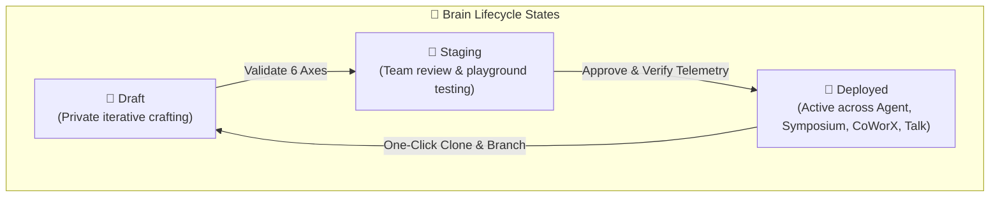

## Enterprise Brain Lifecycle & Governance

Managing dozens of specialized neural experts across an enterprise requires structured governance. Brains Studio provides an operational control plane to categorize, version-control, audit, and deploy domain brains safely across your organization.

---

## 3 Core Lifecycle States

| Lifecycle State | Accessibility Scope | Operational Purpose |
| :--- | :--- | :--- |
| **Draft** | Author only | Rapid iterative prompt engineering, initial file uploads, and testing in the private playground. |
| **Staging** | Author & project team | Departmental review, stress-testing against edge-case prompts, and token budget calibration. |
| **Deployed** | Ecosystem-wide (Personal or Org) | Active in production. Available in the Right Tools Panel of Agent, Symposium panels, CoWorX channels, and Talk voice. |

---

## Folder Hierarchies & Category Categorization

To prevent workspace clutter, Brains Studio offers structured folder management:

<CardGroup cols={3}>
  <Card title="13 Industry Categories" icon="grid-2">
    Assign brains to standardized categories (*Business Strategy*, *Finance & Investment*, *Legal*, *Technology*, *Medical*, etc.) for rapid filtering.
  </Card>
  <Card title="Custom Project Folders" icon="folder-tree">
    Create nested project folders (e.g., *📁 Project Alpha M&A*, *📁 2026 Tax Audits*) to bundle related domain experts together.
  </Card>
  <Card title="Live Brain Counts" icon="calculator">
    Track the number of active brains, bound data files, and total token allocations per folder in real time.
  </Card>
</CardGroup>

---

## Versioning & One-Click Brain Duplication

Modifying a production-deployed Brain directly can disrupt ongoing multi-agent debates or executive reporting threads. AXON provides safe version branching:

<Steps>
  <Step title="Clone Existing Brain">
    Select any deployed Brain in the Central Hub table and click **Duplicate Brain** from the action menu.
  </Step>

  <Step title="Iterate on Cognitive Axes">
    The cloned brain opens as a `Draft` copy (e.g., *M&A Legal Counsel v2.1*). Update prompt directives, replace expired reference PDFs, or refine guardrails in the Monaco editor.
  </Step>

  <Step title="Verify in Playground">
    Use the embedded **Interactive Playground** to submit test prompts and confirm the revised heuristics outperform the prior version.
  </Step>

  <Step title="Promote to Production">
    Once validated, update status to `Deployed` and archive the older version.
  </Step>
</Steps>

---

## Asset Binding & Grounding Maintenance

Enterprise guidelines and tax codes change frequently. Brains Studio makes updating grounded reference knowledge seamless:

* **Hot-Swapping Reference Documents**: Remove outdated reference files and upload revised vector PDFs without reconstructing the 6 cognitive axes.
* **Token Budget Telemetry**: As files are added or removed, Brains Studio dynamically recalculates the exact token footprint across persona, domain rules, and user reference data.
* **Format Compliance Guard**: All uploaded documents must adhere to native format standards (Word/PPT/HWP pre-baked to `PDF`, spreadsheets as `XLSX/CSV/PARQUET`).

---

## Cross-Ecosystem Summoning Matrix

A single deployed Brain operates seamlessly across all 4 flagship AXON interfaces:

| Interface | Integration Mode | Enterprise Use Case |
| :--- | :--- | :--- |
| **🤖 AXON Agent** | Right Context Tools Panel | Single-turn deep research combining Brain heuristics with live SEC/DART filings and data files. |
| **🏛️ AXON Symposium** | Multi-Agent Panel Seat | Multi-expert autonomous debate where the Brain defends domain positions against other experts. |
| **👥 AXON CoWorX** | Team Channel Summoning (`@Brain`) | Collaborative team messenger and live document authoring on shared canvases. |
| **🎙️ AXON Talk** | Real-Time Voice Embodiment | Brain-embodied voice persona for hands-free executive briefings and meeting rehearsals. |

---

## Next Steps

<CardGroup cols={2}>
  <Card title="AXON Symposium: Multi-Agent Debate" icon="users-viewfinder" href="/symposium/overview">
    Explore how to assemble panels of custom Brains for autonomous multi-perspective debates.
  </Card>
  <Card title="AXON CoWorX: Team Channels" icon="comments" href="/coworx/overview">
    Learn how to summon personal Brain agents directly into collaborative team workspaces.
  </Card>
</CardGroup>
