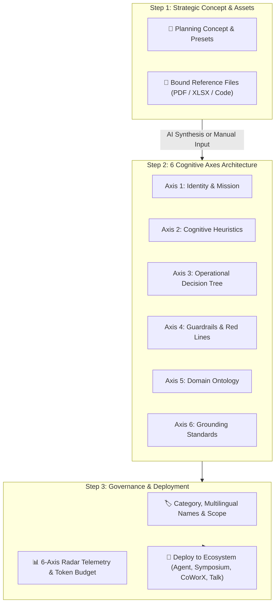

## The Brain Creator Wizard Architecture

Creating an enterprise-grade AI persona requires more than typing a simple prompt. AXON's **Brain Creator Wizard** provides a structured, 3-step cognitive engineering pipeline that transforms organizational guidelines and reference files into a production-ready neural expert:

---

## 2 Creation Pathways: AI-Assisted vs. Manual Pro

<CardGroup cols={2}>
  <Card title="⚡ AI-Assisted Cognitive Compilation" icon="wand-magic-sparkles">
    **Fast 60-Second Setup**
    Describe your objective in plain language or choose a preset. AXON automatically drafts all 6 cognitive axes, extracts ontology terms, and structures decision trees in real time.
  </Card>
  <Card title="🛠️ Manual Pro Crafting" icon="code">
    **Granular Surgical Control**
    Use the embedded Monaco code editor and side-by-side Markdown preview to fine-tune exact prompt directives, token allocations, and non-negotiable red lines.
  </Card>
</CardGroup>

---

## Step 1: Strategic Planning Concept & Bound Data Assets

In the first step, define the core objective of your Brain and bind foundational knowledge assets:

<Steps>
  <Step title="Define the Planning Concept">
    Enter a high-level summary of what this Brain should accomplish (e.g., *"Act as a Senior FDA Regulatory Affairs Specialist specializing in 510(k) medical device clearance and PMA clinical protocols"*).
    * **Concept Presets**: Choose from pre-configured starting templates (*M&A Legal Counsel*, *BioTech Clinical Auditor*, *Tax Structuring Specialist*).
  </Step>

  <Step title="Attach Grounded Reference Files">
    Upload proprietary knowledge documents to permanently bind them to this Brain:
    * **Supported Formats**: `PDF` *(Word/PPT/HWP must be baked to PDF)*, `XLSX`, `CSV`, `TSV`, `PARQUET`, `PY`, `TS`, `JSON`, `MD`, `TXT`.
    * **Governance Limits**: Up to 10 files simultaneously with real-time file size and token footprint calculation.
  </Step>
</Steps>

---

## Step 2: 6-Axis Cognitive Architecture

The second step structures the Brain's reasoning engine across the **6 Foundational Cognitive Axes**:

| Cognitive Axis | Description | Example Configuration |
| :--- | :--- | :--- |
| **1. Identity & Mission** | Persona archetype & core purpose | *"You are Lead Counsel for Silicon Valley venture financings..."* |
| **2. Cognitive Heuristics** | Evaluation rules & tradeoff logic | *"Prioritize non-dilutive liquidation preferences over upfront valuation..."* |
| **3. Decision Tree** | Multi-phase operational methodology | *"Phase 1: Term Sheet Audit ➔ Phase 2: Cap Table Waterfall Modeling..."* |
| **4. Guardrails & Red Lines** | Non-negotiables & compliance bans | *"Never give speculative tax advice. Explicitly flag jurisdiction conflicts."* |
| **5. Domain Ontology** | Acronyms, taxonomies & company terms | *"Define terms: SAFE (Post-Money), QSBS (Section 1202), MFN Clause..."* |
| **6. Grounding Standards** | Citation fidelity & evidence criteria | *"Require page/clause citation `[ref:Page X, Section Y]` for every legal assertion."* |

<Tip>
**Dual-View Monaco & Markdown Editor**: Switch between the Monaco code editor (with syntax highlighting and line numbers) and rendered Markdown preview at any time using the top toolbar icons.
</Tip>

---

## Step 3: Governance, Radar Telemetry & Deployment

The final step finalizes metadata, verifies cognitive balance, and deploys the Brain:

<Steps>
  <Step title="Metadata & Categorization">
    * **Brain Name & Multilingual Localization**: Specify localized names and descriptions across English (`name_en`), Korean (`name_ko`), and Chinese (`name_zh`).
    * **Category & Folder**: Assign to one of the 13 industry domains (*Business Strategy*, *Finance*, *Legal*, *Tech*, *Medical*, etc.) and select a project folder.
  </Step>

  <Step title="Inspect 6-Axis Radar Telemetry">
    Review the real-time **Recharts Radar Diagram** to confirm balanced cognitive depth across all 6 axes. Inspect the exact token ledger broken down by persona, domain rules, and reference data.
  </Step>

  <Step title="Deploy to Ecosystem">
    Click **Save & Deploy Brain**. The newly forged Brain is immediately accessible in the Right Tools Panel of **AXON Agent**, **Symposium**, **CoWorX**, and **Talk**.
  </Step>
</Steps>

---

## Concrete "Aha!" Scenario: Engineering a Healthcare Clinical Trial Brain

> **Mandate**: *"Create an FDA Clinical Protocol Reviewer that checks clinical trial endpoints against FDA Guidance documents."*

1. **Step 1**: Enter the FDA review mandate and attach the official *FDA_Guidance_2026.pdf*.
2. **Step 2**: Click **Auto-Generate Brain**—AXON streams the 6 axes, establishing strict statistical significance criteria in Axis 2 and mandatory page citations in Axis 6.
3. **Step 3**: Assign to *Health & Medical* category, verify the Radar chart, and click **Deploy**.
4. **Immediate Execution**: Open **AXON Agent**, select the new *FDA Clinical Protocol Brain*, and submit an active trial proposal for instant 1-turn audit.

---

## Next Steps

<CardGroup cols={2}>
  <Card title="Brain Governance & Versioning" icon="shield-check" href="/brains/brain-management">
    Learn how to manage brain update cycles, access permissions, and folder organization.
  </Card>
  <Card title="Summoning Brains in Symposium" icon="users-viewfinder" href="/symposium/summoning-expert-panel">
    Seat your newly created custom Brains on a multi-agent autonomous debate panel.
  </Card>
</CardGroup>
