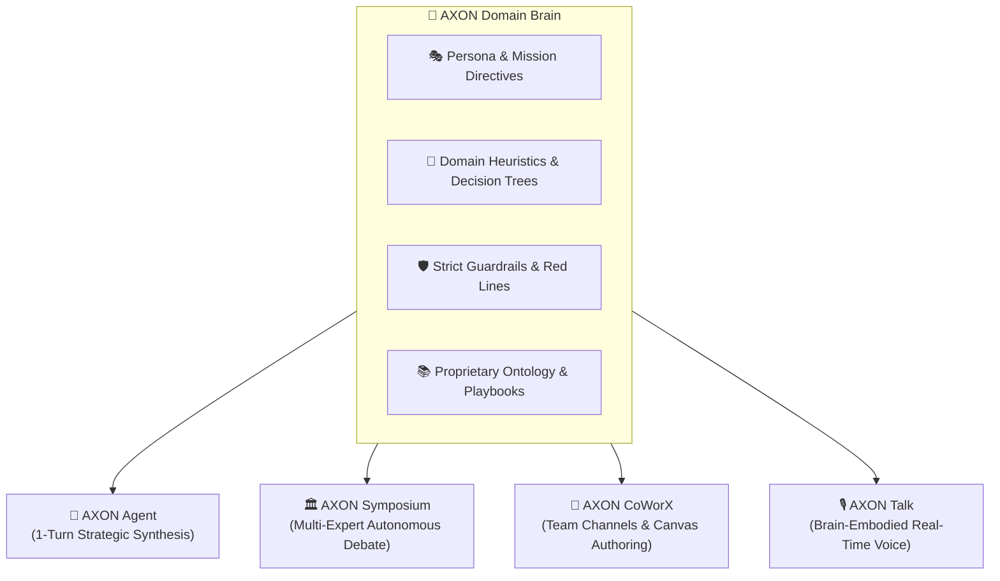

## What is an AXON Brain?

In enterprise AI adoption, generic foundation models lack your organization's unique vocabulary, evaluation heuristics, and non-negotiable risk policies.

An **AXON Brain** is a specialized, persistent **Domain Neural Expert**. It packages proprietary organizational knowledge, professional personas, compliance guardrails, and reference notes into an assetized cognitive container that can be summoned across the entire AXON ecosystem:



---

## Platform Curated vs. Personal Custom Brains

Brains Studio organizes neural knowledge into two distinct operational scopes:

<CardGroup cols={2}>
  <Card title="🏛️ Platform Curated Brains" icon="building-columns">
    **Out-of-the-Box Domain Experts**
    Pre-configured neural hubs covering Silicon Valley IP law, Wall Street financial auditing, FDA clinical trial compliance, and cloud systems architecture.
  </Card>
  <Card title="💼 Personal & Enterprise Brains" icon="user-gear">
    **Bespoke Proprietary Intelligence**
    Custom brains engineered by your teams, embedding internal standard operating procedures (SOPs), company playbooks, and proprietary valuation models.
  </Card>
</CardGroup>

---

## The 6 Cognitive Axes of an Enterprise Brain

Every AXON Brain is structured around 6 foundational cognitive dimensions to guarantee deterministic, repeatable expert reasoning:

| Cognitive Axis | Focus Dimension | Operational Impact |
| :--- | :--- | :--- |
| **Axis 1: Identity & Mission** | Role archetype & executive persona | Establishes professional perspective, authority, and tone |
| **Axis 2: Cognitive Heuristics** | Domain analytical frameworks | Governs how the brain structures evaluations and tradeoffs |
| **Axis 3: Decision Trees** | Operational workflows & steps | Standardizes multi-phase execution methodologies |
| **Axis 4: Guardrails & Red Lines** | Invariants & compliance bounds | Prevents prohibited actions, security violations, and regulatory risks |
| **Axis 5: Domain Ontology** | Terminology & company playbooks | Fuses internal organizational acronyms, formulas, and taxonomies |
| **Axis 6: Grounding Standards** | Evidence & citation fidelity | Enforces evidence benchmarks and mandatory source verification |

---

## Anatomy of Brains Studio

Brains Studio provides a centralized command center for creating, managing, and inspecting domain intelligence:

```
┌─────────────────┬──────────────────────────────────┬─────────────────┐
│ 📁 Categories   │ 🧠 Brains Management Hub         │ 🔍 Detail Panel │
│ • Business      │ • Silicon Valley IP Attorney     │ • 6 Axes View   │
│ • Finance       │ • Wall Street M&A Auditor        │ • Token Ledger  │
│ • Legal         │ • BioTech FDA Regulatory Hub     │ • Bound Assets  │
│ • Technology    │ • Healthcare Clinical Advisor    │ • Quick Test    │
└─────────────────┴──────────────────────────────────┴─────────────────┘
```

<Tabs>
  <Tab title="1. Category & Scope Drawer">
    * **13 Industry Categories**: Filter brains by *Business Strategy*, *Finance & Investment*, *Law & Governance*, *Health & Medical*, *Tech & IT*, and more.
    * **Scope Filter**: Seamlessly toggle between **All Brains**, **Platform Brains**, and **My Custom Brains**.
  </Tab>

  <Tab title="2. Central Brains Hub Table">
    * **High-Density Overview**: View brain names, localized descriptions (`EN / KO / ZH`), author tags, and exact token counts.
    * **Lifecycle Status Badges**: Track brain maturity across `Draft`, `Staging`, and `Deployed`.
    * **Fast Search & Action Bar**: Instantly filter brains by keyword or launch the interactive **Brain Creator Wizard**.
  </Tab>

  <Tab title="3. Right Detail & Telemetry Panel">
    * **Cognitive Axis Inspector**: Expand each of the 6 cognitive axes to review or edit prompt directives.
    * **Mathematical Token Breakdown**: Inspect exact token footprints across persona, domain rules, and user reference data.
    * **Interactive Playground**: Test brain responses in real time before deploying to production channels.
  </Tab>
</Tabs>

---

## Concrete "Aha!" Scenario: Reusing One Brain Across 4 Flagship Apps

Consider a **Silicon Valley Patent & IP Litigation Brain** created in Brains Studio:

<Steps>
  <Step title="Summon in AXON Agent">
    Attach the IP Brain in the Right Tools Panel to audit an attached patent PDF and live USPTO records in a 1-turn analysis.
  </Step>

  <Step title="Summon in AXON Symposium">
    Seat the IP Brain on an autonomous Symposium panel alongside stakeholder domain Brains to debate an intellectual property acquisition.
  </Step>

  <Step title="Summon in AXON CoWorX">
    Mention `@IP_Attorney_Brain` in a shared team channel to draft patent claim amendments directly onto a live collaborative canvas.
  </Step>

  <Step title="Summon in AXON Talk">
    Select the IP Brain in AXON Talk to conduct a real-time hands-free voice rehearsal for an upcoming patent trial cross-examination.
  </Step>
</Steps>

---

## Next Steps

<CardGroup cols={2}>
  <Card title="Step-by-Step Brain Creation" icon="wand-magic-sparkles" href="/brains/creating-brains">
    Follow the complete guide to engineering your first custom enterprise brain with the Brain Creator Wizard.
  </Card>
  <Card title="Brain Governance & Access Control" icon="shield-check" href="/brains/brain-management">
    Learn how to manage brain versioning, organizational folder categorization, and role-based access permissions.
  </Card>
</CardGroup>
