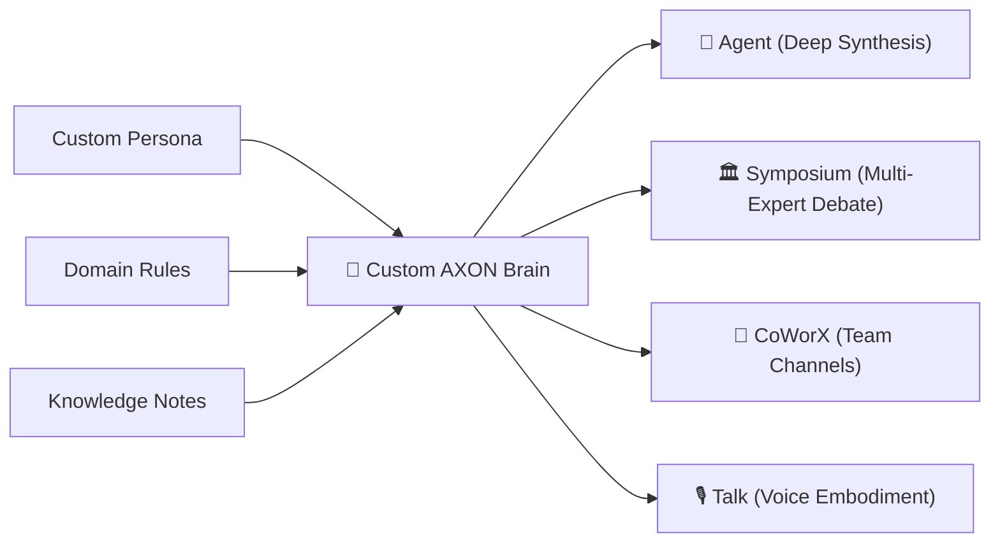

## What is an AXON Brain?

An **AXON Brain** is a dedicated, custom neural knowledge container that packages:
* **Custom Persona & Role Guidelines**: Specialized instructions (e.g., *"Act as a Senior Silicon Valley IP Attorney"*).
* **Domain Rules & Invariants**: Mandatory evaluation criteria, formatting rules, and strict constraints.
* **Proprietary Knowledge Notes**: Uploaded research notes, company playbooks, and strategic frameworks.

