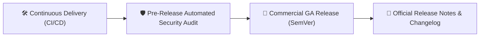

## Enterprise Release Governance

Enterprise organizations rely on predictable, transparent release cycles to plan deployment audits, security reviews, and employee training. Gōsuto X maintains strict versioning and release governance across the entire AXON ecosystem.

---

## Semantic Versioning (SemVer) Standards

AXON adheres strictly to **Semantic Versioning 2.0.0** (`MAJOR.MINOR.PATCH`):

| Version Component | Trigger Criteria | Enterprise Impact |
| :--- | :--- | :--- |
| **MAJOR (vX.0.0)** | Fundamental architectural shifts, breaking API updates, or new flagship applications | Advance notice provided; backward compatibility migration windows supported |
| **MINOR (v1.X.0)** | New enterprise capabilities, additional verified API channels, or performance enhancements | Zero downtime; immediate availability across all active workspaces |
| **PATCH (v1.0.X)** | Critical security patches, bug remediation, or UI styling refinements | Continuous automated delivery via GitOps and ArgoCD |

---

## Single Source of Truth (SSOT) Version Authority

Every microservice, frontend asset bundle, Docker image tag, and documentation page derives its authoritative version string strictly from the root `VERSION` file in source repositories.

---

## Release History Matrix

<CardGroup cols={2}>
  <Card title="v1.0.0 Commercial GA Launch" icon="rocket" href="/changelog/v1-0-0">
    **October 2026** · Official commercial launch of Gōsuto X Inc. and the 7-app AXON Universal Operating System.
  </Card>
</CardGroup>
