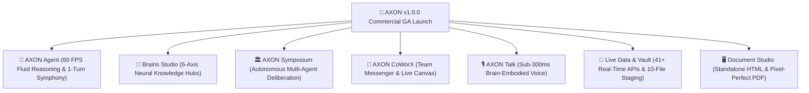

## v1.0.0 Commercial General Availability (GA) Launch · October 2026

We are thrilled to announce the official commercial General Availability (GA) release of **Gōsuto X Inc.** and the **AXON Universal Operating System**—the world's first AI 2.0 collaborative platform uniting multi-modal agents, bespoke neural brains, multi-agent debates, and executive document publishing.

---

## 🚀 Flagship Ecosystem Capabilities

### 1. AXON Agent Suite (Core AI Engine)
* **1-Turn Tool Symphony**: Combine proprietary Brains, 41+ live APIs, and up to 10 data files simultaneously in a single prompt turn.
* **Dual Reasoning Modes**: Sub-second **Flash Mode** for operational velocity vs. deep multi-step **Think Mode** with real-time collapsible thinking traces.
* **60 FPS Fluid Stream Typist**: High-density streaming text engine with intelligent scroll locks and zero stutter.
* **Structured Session Governance**: Custom nested folder hierarchies, optimistic SWR rollback, and `Cmd + K` real-time search.

### 2. Brains Studio (Neural Knowledge Hubs)
* **6-Axis Cognitive Architecture**: Configure Identity & Mission, Cognitive Heuristics, Decision Trees, Guardrails & Red Lines, Domain Ontology, and Grounding Standards.
* **3-Step Brain Creator Wizard**: AI-assisted autonomous compilation or manual Monaco pro code crafting with live **Recharts 6-Axis Radar Telemetry**.
* **Ecosystem-Wide Cross-Summoning**: Deploy once, summon across Agent, Symposium panels, CoWorX team channels, and Talk voice.

### 3. AXON Symposium (Multi-Agent Debate)
* **Autonomous Multi-Agent Deliberation**: Convene up to 4 domain Brains (Legal, Finance, Tech, Risk) to cross-examine assumptions and stress-test corporate decisions.
* **3D Communication Force Graph**: Interactive 3D vector graph tracking argument flows, rebuttal pulses, and consensus weights in real time.
* **Unanimous Consensus Reports**: Synthesize debate outcomes into boardroom-grade deliverables with reconciled risk matrices.

### 4. AXON CoWorX (Team Collaborative Workspace)
* **Multi-User Team Channels**: Public department channels and private executive rooms with sub-millisecond WebSocket messaging.
* **Instant `@Mention` Brain Summoning**: Bring specialized AI teammates into human discussions with full contextual memory.
* **Shared Live Document Canvas**: Split-screen editor allowing humans and AI agents to co-author living reports in real time.

### 5. AXON Talk (Brain-Embodied Voice)
* **Sub-300ms Duplex Audio Stream**: Pure non-blocking WebSocket audio pipeline with instant voice barge-in (sub-50ms).
* **Bespoke Brain Embodiment**: Voice personas adopt the exact professional posture, vocabulary, and risk heuristics of selected Brains.
* **Simultaneous Dual-Stream Transcription**: Every spoken turn is auto-transcribed and saved to session history for one-click PDF export.

### 6. Live Data & Multimodal Vault
* **41+ Verified Global API Feeds**: Direct streaming from US SEC EDGAR, Korea DART, Federal Reserve (FRED), FDA Approvals, ArXiv, and global market exchanges.
* **Multimodal Data Vault**: Native parsing across 6 core categories (`PDF`, `XLSX`, `CSV`, `PARQUET`, Code, Images, Audio, Video).
* **Strict PDF Pre-Processing Policy**: Word (`.docx`), PowerPoint (`.pptx`), and Hangul (`.hwp`) baked to PDF for 100% loss-free visual vector grounding.

### 7. Document Studio & Publishing Suite
* **Standalone Zero-Dependency HTML Export**: Single-file `.html` bundles running offline across any modern browser with embedded styles and interactive JS.
* **Pixel-Perfect PDF Printing Engine**: Automated Two-Pass Rendering Sweep guaranteeing zero page-split truncation on complex tables and charts.
* **A4 & US Letter Viewport Toggle**: Fluid page format switching and dual-theme synchronization (**Solid Navy Mirage** vs. **Translucent Frost Glass**).

### 8. Multi-Region Data Sovereignty & Enterprise Trust
* **Regional Data Isolation**: Dedicated datacenters in Seoul (`account-kr`, PIPA compliant) and Iowa (`account-us`, CCPA/GDPR compliant).
* **Zero Model Training Guarantee**: Contractual assurance that customer data, uploaded files, and transcripts are never used for AI training.
* **Encapsulated Stripe Billing**: PCI-DSS Level 1 payment gateway with 100% mathematical token accounting.

---

## Documentation & Support

* **Documentation Portal**: [https://docs.gosutox.com](https://docs.gosutox.com)
* **Corporate Website**: [https://www.gosutox.com](https://www.gosutox.com)
* **Web Application**: [https://axon.gosutox.com](https://axon.gosutox.com)
* **Customer Support**: `support@gosutox.com`
