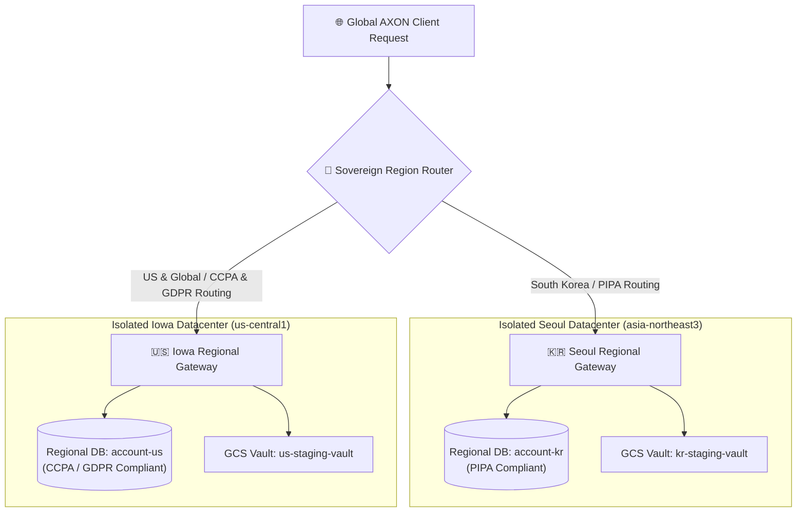

## Enterprise Data Residency & Legal Compliance

Modern multinational enterprises operate under complex, conflicting data privacy regulations. South Korea's **Personal Information Protection Act (PIPA)** strictly mandates domestic data residency for citizens' personal data, while the European Union's **GDPR** and California's **CCPA** impose strict cross-border transfer and residency perimeters.

AXON is engineered from the ground up with **Sovereign Multi-Region Data Isolation**. Customer credentials, profile records, uploaded files, and conversation histories are physically and logically pinned to your chosen regional jurisdiction:

---

## Regional Datacenter Architecture

<CardGroup cols={2}>
  <Card title="South Korea Region (PIPA Sovereign)" icon="shield-halved">
    * **Cloud Project**: `gosutox-account-prod`
    * **Regional Database**: `account-kr` (Seoul, `asia-northeast3`)
    * **Legal Perimeter**: Korean Personal Information Protection Act (PIPA)
    * **Isolation Rule**: Zero cross-border WAN replication or overseas data syncing. All user PII and files remain inside South Korea.
  </Card>
  <Card title="United States & Global (CCPA / GDPR)" icon="globe">
    * **Cloud Project**: `gosutox-account-prod`
    * **Regional Database**: `account-us` (Iowa, `us-central1`)
    * **Legal Perimeter**: US CCPA and EU GDPR Data Residency Standards
    * **Isolation Rule**: Dedicated database cluster with strict geographic pinning and independent Cloud KMS encryption keys.
  </Card>
</CardGroup>

---

## 4 Legal & Architectural Invariants

| Invariant Rule | Technical Implementation | Compliance Standard |
| :--- | :--- | :--- |
| **Zero Cross-Regional Identity Mixing** | User accounts, credentials, and tokens are stored exclusively in their designated regional database (`account-kr` or `account-us`) | PIPA Article 17 / GDPR Chapter V |
| **Sub-300ms Single-Region Fast Path** | Authentication queries target the user's home region directly, eliminating sequential cross-continent WAN probing | ISO/IEC 27001 Performance SLA |
| **Regionally Pinned Storage Vaults** | Multimodal files and vector embeddings are stored in dedicated regional Cloud Storage buckets | Data Residency Mandates |
| **Independent Regional Encryption** | Each region uses dedicated Cloud KMS encryption keyrings with separate key rotation schedules | FIPS 140-2 Level 3 Hardware Security |

---

## Visual Sovereign Region Indicator

Inside the AXON interface, the top navigation bar displays a persistent **Sovereign Region Badge** (`🇰🇷 KR (Seoul)` or `🇺🇸 US (Iowa)`), providing continuous visual assurance of active legal data isolation during every prompt turn.

---

## Next Steps

<CardGroup cols={2}>
  <Card title="Zero-Training Legal Guarantee" icon="lock" href="/trust/zero-training-guarantee">
    Review our contractual commitment that customer data is never used to train AI models.
  </Card>
  <Card title="Token Economics & Billing Governance" icon="coins" href="/trust/token-economics-billing">
    Learn how subscription tiers, credits, and Stripe billing are managed with mathematical precision.
  </Card>
</CardGroup>
