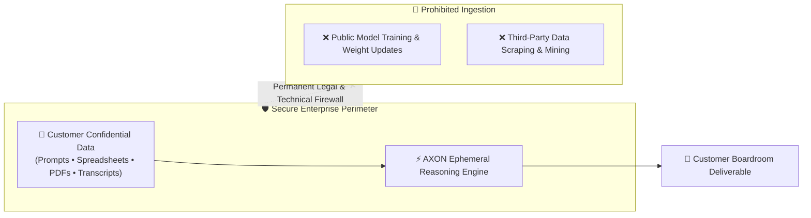

## The Zero-Training Legal Invariant

For enterprise organizations, intellectual property leakage is an existential risk. Uploading proprietary source code, M&A deal structures, or medical clinical data to consumer AI platforms exposes trade secrets to public training pools.

**AXON operates under an absolute legal guarantee**:
> **Zero Customer Data Ingestion Guarantee**:
> Under no circumstances is customer data—including prompts, uploaded files, attached Brain heuristics, voice transcripts, or generated documents—ever used to train, retrain, fine-tune, or improve foundational AI models or public neural weights.

---

## 4 Pillars of Enterprise Security

<CardGroup cols={2}>
  <Card title="Encryption in Transit (TLS 1.3)" icon="network-wired">
    All communication between client browsers, mobile devices, and AXON regional clusters is secured with mandatory TLS 1.3 encryption and modern cipher suites.
  </Card>
  <Card title="Encryption at Rest (AES-256 / CMEK)" icon="database">
    All database records, vector indexes, and cloud storage vaults are encrypted using military-grade AES-256 with regional Customer-Managed Encryption Keys.
  </Card>
  <Card title="Ephemeral Memory Scrubbing" icon="broom">
    Staged multimodal files and reasoning context buffers in active GPU/CPU memory are automatically scrubbed upon session completion or timeout.
  </Card>
  <Card title="Strict Role-Based ABAC Access" icon="user-lock">
    Attribute-based access controls ensure that even within your organization, only authorized team members can access designated Brains or private channels.
  </Card>
</CardGroup>

---

## Compliance & Certification Alignment

| Standard / Framework | Scope of Compliance | Audit Frequency |
| :--- | :--- | :--- |
| **SOC 2 Type II** | Security, Confidentiality, and Availability controls across all cloud services | Annual independent third-party audit |
| **ISO/IEC 27001** | Information Security Management System (ISMS) governing infrastructure and ops | Continuous monitoring & annual surveillance |
| **GDPR & CCPA** | Right to erasure, data portability, and strict residency isolation | Continuous automated legal compliance |
| **PIPA (South Korea)** | Personal Information Protection Act compliance for Korean domestic workloads | Continuous automated data isolation |

---

## Next Steps

<CardGroup cols={2}>
  <Card title="Token Economics & Billing Governance" icon="coins" href="/trust/token-economics-billing">
    Understand how mathematical token deductions and enterprise billing quotas operate.
  </Card>
  <Card title="Refund & Cancellation Policy" icon="credit-card" href="/trust/refund-and-cancellation">
    Review our 14-day 100% money-back guarantee and self-serve billing controls.
  </Card>
</CardGroup>
