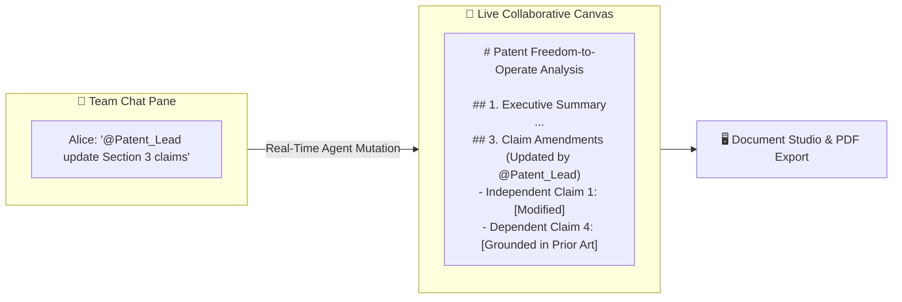

## The Collaborative Living Canvas

Conversational chat threads are ideal for debate and discussion, but final deliverables require structured, persistent documents.

The **CoWorX Live Canvas** provides an interactive, split-screen document editor embedded directly alongside your team chat. Human team members and summoned AI Brains can simultaneously write, format tables, code algorithms, and refine executive prose:

---

## Key Features of the Live Canvas

<CardGroup cols={3}>
  <Card title="Split-Screen Synergy" icon="columns-2">
    Chat and debate on the left pane while continuously evolving a formal deliverable on the right pane in real time.
  </Card>
  <Card title="Agent-Assisted Drafting" icon="wand-magic-sparkles">
    Instruct summoned Brains to write entire sections, generate financial comparison tables, or perform legal clause audits.
  </Card>
  <Card title="Real-Time Human Co-Editing" icon="user-pen">
    Manually edit, reformat, or delete AI-generated sections with full rich Markdown, Monaco code blocks, and table support.
  </Card>
</CardGroup>

---

## 4 Common Canvas Authoring Workflows

<AccordionGroup>
  <Accordion title="1. Autonomous Section Drafting" icon="file-pen">
    Command a summoned Brain in chat: *"@Tax_Strategist, draft Section 4 (QSBS Tax Optimization) on the canvas using our attached Series A capitalization model."* The Brain writes the complete section directly into the document structure.
  </Accordion>

  <Accordion title="2. Table Population & Calculation" icon="table">
    Ask an agent to summarize conflicting data points: *"@Financial_Analyst, generate a comparative valuation matrix on the canvas comparing Target A against 3 public peers."* The Brain inserts a formatted Markdown table with calculated ratios.
  </Accordion>

  <Accordion title="3. Legal Red-Lining & Risk Auditing" icon="scale-balanced">
    Request a legal review: *"@IP_Counsel, audit Section 2 on the canvas and flag any ambiguous indemnification wording."* The Brain reviews the text and highlights required revisions directly in the document.
  </Accordion>

  <Accordion title="4. Standalone Code & Algorithm Mounts" icon="code">
    Instruct a technical brain: *"@Cloud_Architect, add a Terraform infrastructure snippet for our multi-region GKE deployment to the technical appendix."* The Brain appends syntax-highlighted HCL code blocks.
  </Accordion>
</AccordionGroup>

---

## One-Click Publishing to Document Studio

When your collaborative document is finalized, export it with executive publishing fidelity:

<Steps>
  <Step title="Click Export Document">
    Click the **Export to Document Studio** button at the top-right of the Live Canvas toolbar.
  </Step>

  <Step title="Select Deliverable Format">
    * **Download Standalone HTML**: Receive a zero-dependency `.html` bundle ready for offline client distribution.
    * **Print / Export PDF**: Trigger the two-pass PDF engine with `@media print` zero page-split guarantees and corporate watermarks.
  </Step>
</Steps>

---

## Next Steps

<CardGroup cols={2}>
  <Card title="Team & Workspace Management" icon="users-gear" href="/coworx/team-workspace-management">
    Learn how to manage channel permissions, access control policies, and member roles.
  </Card>
  <Card title="AXON Talk: Voice Collaboration" icon="microphone" href="/talk/overview">
    Explore how Brain-embodied voices enable hands-free executive communication.
  </Card>
</CardGroup>
