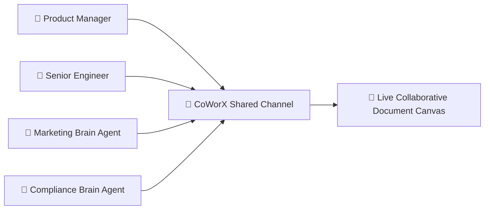

## Fusing Human Intelligence with Team AI Brains

**AXON CoWorX** is an enterprise collaborative workspace where human team members and custom Brain-infused AI agents work together in real time.

### Key Capabilities
* **Multi-User Channels**: Create dedicated project channels for teams.
* **@Mention Brain Agents**: Summon any custom Brain directly into conversation threads.
* **Shared Document Canvas**: Live co-authoring of reports, specifications, and project briefs.
* **Virtual File System (VFS)**: Shared workspace asset storage for team documents.
