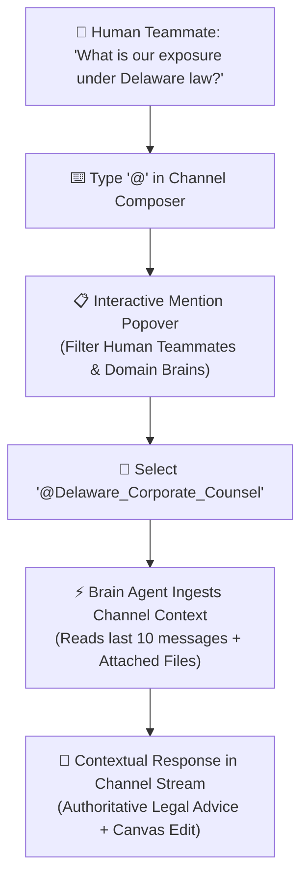

## The AI Teammate Paradigm

In AXON CoWorX, AI is not a generic background tool; it participates as an active team member with distinct domain expertise, specialized heuristics, and clear role boundaries.

By typing `@` in any channel composer, you can summon any **Platform Curated Brain** or **Personal Custom Brain** directly into your team conversation:



---

## How the Mention Popover Works

When you type `@` into the CoWorX message input area, the **Mention Popover** (`CoworxMentionPopover.tsx`) activates instantly:

<CardGroup cols={2}>
  <Card title="👥 Human Teammates" icon="user">
    Filter colleagues by name or email. Mentioning a human notifies them in real time across their active sessions.
  </Card>
  <Card title="🧠 AI Domain Brains" icon="brain">
    Browse your organization's entire Brain library with live category icons, scope badges (`Platform` / `Personal`), and token indicators.
  </Card>
</CardGroup>

---

## Step-by-Step Summoning Workflow

<Steps>
  <Step title="Open Any Team Channel">
    Navigate to your desired public channel (e.g., `#finance-review`) or private project room.
  </Step>

  <Step title="Trigger the Mention Menu">
    Type `@` into the message composer. Start typing the brain's name (e.g., `@M&A_Counsel`) to filter suggestions in sub-milliseconds.
  </Step>

  <Step title="Assign the Task Mandate">
    Combine your mention with specific instructions:
    > *"@M&A_Counsel, please review the valuation multiples in the attached `Series_B_Model.xlsx` and verify if the 1.5x liquidation preference matches our corporate investment guidelines."*
  </Step>

  <Step title="Context Ingestion & Collaborative Execution">
    The summoned Brain parses recent channel messages, analyzes attached spreadsheets or PDFs, and delivers a grounded response in the thread. If requested, it simultaneously drafts revisions on the **Live Document Canvas**.
  </Step>
</Steps>

---

## Multi-Brain Collaboration in Single Threads

You can mention multiple AI Brains within the same conversation thread to trigger cross-disciplinary human-AI collaboration:

```
[11:05] Alice (VP Product): @Tech_Architect @SecOps_Lead How should we handle multi-region tenant isolation for EU clients?

[11:06] 🤖 @Tech_Architect:
Based on our cloud architecture standards, we should deploy dedicated GKE clusters in Frankfurt (europe-west3) with localized Firestore databases.

[11:07] 🤖 @SecOps_Lead:
Agreed. Ensure Cloud KMS keys are regionally isolated to prevent cross-border key escrow. I've updated the compliance checklist on the right canvas.
```

---

## Next Steps

<CardGroup cols={2}>
  <Card title="Live Canvas Document Authoring" icon="pen-nib" href="/coworx/live-canvas-authoring">
    Learn how summoned Brains write, format, and edit documents collaboratively on the shared canvas.
  </Card>
  <Card title="Team & Workspace Management" icon="users-gear" href="/coworx/team-workspace-management">
    Configure channel roles, member permissions, and Brain summoning access controls.
  </Card>
</CardGroup>
