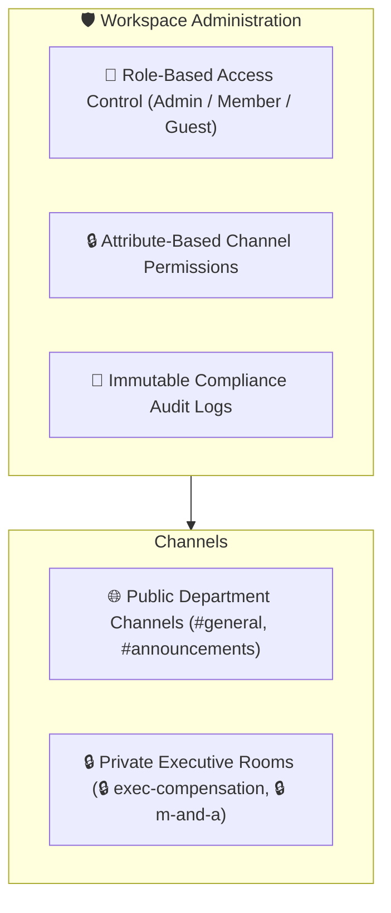

## Enterprise Workspace Governance

AXON CoWorX enforces strict enterprise-grade security and governance to ensure confidential corporate discussions, financial forecasts, and proprietary IP assets remain securely isolated.

---

## Channel Access Types & Permission Tiers

<CardGroup cols={2}>
  <Card title="🌐 Public Team Channels" icon="globe">
    **Open Department Workspaces**
    Accessible to all authorized team members in your organization. Ideal for general research, shared engineering channels, and cross-functional updates.
  </Card>
  <Card title="🔒 Private Project Rooms" icon="lock">
    **Restricted Executive Spaces**
    Accessible only to explicitly invited members. Perfect for M&A deal rooms, executive compensation audits, and sensitive patent filings.
  </Card>
</CardGroup>

---

## 3 User Role Tiers (RBAC)

| Role Tier | Channel Permissions | Brain Summoning Scope | Canvas Publishing |
| :--- | :--- | :--- | :--- |
| **Workspace Admin** | Full management (Create, Archive, Delete channels, Invite members) | Can summon all Platform & Organization Brains | Full HTML/PDF export & publishing |
| **Team Member** | Join public channels, create private project rooms | Can summon assigned Brains and Personal Brains | Full collaborative editing & export |
| **External Guest** | Access restricted to single explicitly invited channel | Can interact only with pre-approved channel Brains | Read-only or restricted comment access |

---

## Compliance Audit Trails & Data Isolation

* **Immutable Activity Logs**: Every message, `@Brain` invocation, document revision, and file download is timestamped and recorded in centralized audit logs.
* **Regional Data Residency**: In accordance with PIPA (South Korea) and GDPR/CCPA (Global/US), channel messages and VFS files remain permanently within your organization's designated geographic datacenter (`KR / US`).
* **Zero Model Training Guarantee**: CoWorX conversations and canvas drafts are strictly excluded from AI model training or external telemetry.

---

## Next Steps

<CardGroup cols={2}>
  <Card title="AXON Talk: Voice Collaboration" icon="microphone" href="/talk/overview">
    Discover how to converse with Brain-embodied voices in real time for hands-free executive communication.
  </Card>
  <Card title="Live Data & Multimodal Vault" icon="database" href="/data/live-data-architecture">
    Explore how 41+ live APIs and multimodal data staging feed into all AXON applications.
  </Card>
</CardGroup>
