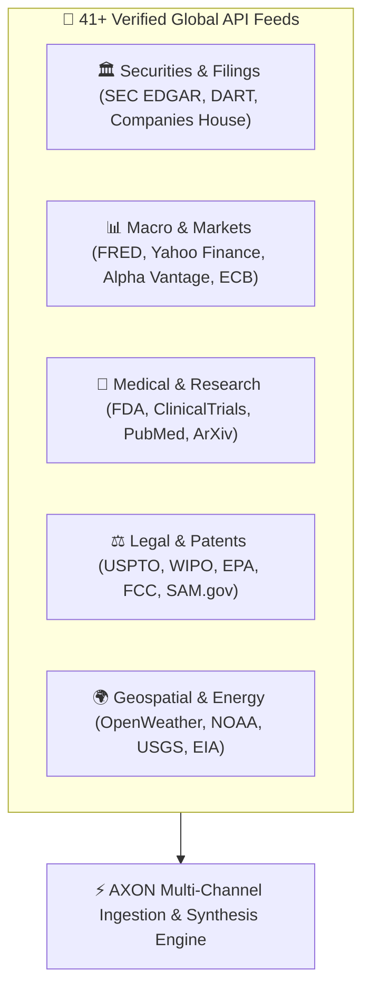

## Comprehensive Live Data Directory

AXON integrates over **41 verified live data channels** categorized into 5 major enterprise domains. Each feed streams structured data directly from authoritative servers without intermediary scraping:



---

## The 5 Major Data Categories

<Tabs>
  <Tab title="1. Securities & Corporate Filings">
    | Channel | Official Authority | Coverage & Data Points |
    | :--- | :--- | :--- |
    | **US SEC EDGAR** | US Securities & Exchange Commission | Real-time 10-K, 10-Q, 8-K, Form 4 insider trades, XBRL financials |
    | **Korea DART (FSS)** | Financial Supervisory Service (KR) | Korean corporate public disclosures, auditor notes, major shareholdings |
    | **UK Companies House** | UK Executive Agency | British company incorporation records, annual accounts, officer filings |
    | **Japan EDINET** | Financial Services Agency (JP) | Japanese securities reports, semi-annual filings, corporate governance |
  </Tab>

  <Tab title="2. Macroeconomics & Financial Markets">
    | Channel | Official Authority | Coverage & Data Points |
    | :--- | :--- | :--- |
    | **Federal Reserve (FRED)** | Federal Reserve Bank of St. Louis | 800,000+ US/global economic time series, CPI, Treasury yield curve |
    | **Yahoo Finance** | Global Market Exchange Stream | Real-time stock quotes, ETF holdings, historical price series, FX rates |
    | **Alpha Vantage** | Financial Market Data API | Real-time equity technical indicators, FX pairs, crypto assets |
    | **World Bank Open Data** | The World Bank Group | Global development indicators, GDP growth, poverty metrics |
    | **IMF Economic Outlook** | International Monetary Fund | World economic forecasts, sovereign debt ratios, balance of payments |
    | **CoinGecko Digital Assets** | Global Crypto Data Provider | 10,000+ cryptocurrency spot prices, on-chain liquidity, tokenomics |
  </Tab>

  <Tab title="3. Medical, Biotech & Scientific Research">
    | Channel | Official Authority | Coverage & Data Points |
    | :--- | :--- | :--- |
    | **FDA Regulatory Feeds** | US Food & Drug Administration | Drug approvals, 510(k) medical device clearances, recall alerts |
    | **ClinicalTrials.gov** | US National Library of Medicine | Global clinical trial registry, Phase 1-4 trial endpoints, sponsor data |
    | **PubMed Biomedical** | National Center for Biotech Info | 36M+ biomedical citations, peer-reviewed medical journals |
    | **ArXiv Preprints** | Cornell University | Advanced research papers in AI, machine learning, physics, math |
    | **Semantic Scholar** | Allen Institute for AI | AI-powered scientific literature graphs, citation influence metrics |
  </Tab>

  <Tab title="4. Legal, Patents & Government Registries">
    | Channel | Official Authority | Coverage & Data Points |
    | :--- | :--- | :--- |
    | **USPTO Patent Database** | US Patent & Trademark Office | Granted US patents, published patent applications, patent litigation |
    | **WIPO Global Brand** | World Intellectual Property Org | International trademark registrations and brand classifications |
    | **EPA Compliance Feeds** | Environmental Protection Agency | Facility environmental compliance history, emissions enforcement |
    | **FCC Equipment Registry** | Federal Communications Commission | Wireless device certifications, RF exposure test reports |
    | **SAM.gov Procurement** | US Federal Government | Federal contract awards, vendor registrations, active RFP solicitations |
  </Tab>

  <Tab title="5. Geospatial, Weather & Energy">
    | Channel | Official Authority | Coverage & Data Points |
    | :--- | :--- | :--- |
    | **OpenWeather Global** | Global Meteorological Network | Real-time weather radar, hourly forecasts, historical weather data |
    | **NOAA Climate Data** | US Oceanic & Atmospheric Admin | Severe storm tracking, oceanic temperatures, climate trend indices |
    | **USGS Seismic Feeds** | US Geological Survey | Real-time global earthquake tracking, fault line telemetry |
    | **FlightAware ADS-B** | Flight Tracking Network | Real-time aircraft positions, airport flight delays, route telemetry |
    | **EIA Energy Feeds** | US Energy Information Admin | Crude oil inventories, natural gas storage, renewable energy output |
  </Tab>
</Tabs>

---

## Production Copy-Paste Prompt Catalog

Use these verified prompt templates to query live data channels with optimal precision:

<AccordionGroup>
  <Accordion title="📋 SEC EDGAR: Comparative Gross Margin Analysis" icon="file-invoice-dollar">
    ```
    "Query SEC EDGAR for Tesla (TSLA) and Rivian (RIVN) latest 10-Q filings. Extract automotive gross margins (excluding regulatory credits), cash burn rate, and capital expenditures for the last two fiscal quarters. Present in a side-by-side Markdown comparison table."
    ```
  </Accordion>

  <Accordion title="📊 FRED: Macroeconomic Interest Rate Sensitivity" icon="chart-line">
    ```
    "Pull the latest 10-Year US Treasury Constant Maturity Yield (GS10) and Core CPI (CPILFESL) from FRED. Analyze how the yield curve inversion compares against the 2007-2008 pre-recession benchmark."
    ```
  </Accordion>

  <Accordion title="🏥 FDA 510(k): Medical Device Clearance Audit" icon="flask">
    ```
    "Search FDA 510(k) clearances over the last 12 months for orthopedic surgical robotics. Identify all clearance summaries granted to Intuitive Surgical, Stryker, and Medtronic, noting the substantial equivalence predicate devices cited."
    ```
  </Accordion>

  <Accordion title="⚖️ USPTO: Patent Prior-Art Investigation" icon="certificate">
    ```
    "Search USPTO patent applications published in 2025-2026 covering transformer architecture quantization and sparsity. List top 5 assignee corporations and summarize claim 1 for the most heavily cited application."
    ```
  </Accordion>
</AccordionGroup>

---

## Next Steps

<CardGroup cols={2}>
  <Card title="Multimodal Data Files Vault" icon="folder-open" href="/data/multimodal-staging-vault">
    Learn how to stage internal spreadsheets, PDFs, and code files alongside live API streams.
  </Card>
  <Card title="Document Studio & Viewer" icon="window-maximize" href="/studio/document-viewer">
    See how live data analyses are converted into standalone interactive HTML reports and boardroom PDFs.
  </Card>
</CardGroup>
