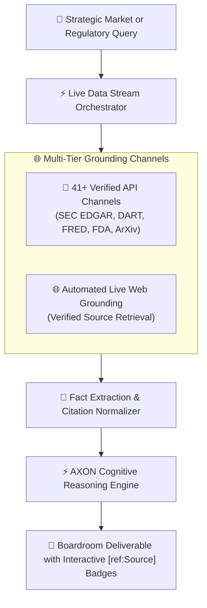

## Eliminating the Knowledge Cutoff Boundary

Standard AI models are constrained by static training cutoff dates, rendering them incapable of tracking today's earnings releases, regulatory policy updates, or breaking market news. When pressed for current information, generic models either refuse or hallucinate plausible-sounding falsehoods.

**AXON's Live Data Architecture** permanently eliminates the knowledge cutoff boundary. Operating across **41+ Verified Global API Feeds** and **Automated Live Web Grounding**, AXON streams live regulatory filings, financial data, and scientific preprints directly into active conversation turns:



---

## 4 Architectural Principles of Live Data

<CardGroup cols={2}>
  <Card title="Zero Knowledge Cutoff" icon="clock">
    Access real-time disclosures filed minutes ago with direct streaming from official government and financial servers.
  </Card>
  <Card title="Zero-Hallucination Grounding" icon="shield-check">
    Every assertion is strictly attributed to official database records using interactive, clickable `[ref:Source]` citation badges.
  </Card>
  <Card title="Transparent Fallback Contingency" icon="triangle-exclamation">
    If a specialized API encounters upstream server turbulence, AXON automatically engages verified web grounding and explicitly discloses the fallback source.
  </Card>
  <Card title="Zero Token Waste" icon="gauge">
    Only active toggled API channels are queried during a turn, eliminating context bloat and maintaining mathematical token billing precision.
  </Card>
</CardGroup>

---

## How Citation & Attribution Badging Works

Every data point extracted from an external channel is rendered with an interactive citation badge:

```markdown
> NVIDIA reported Q3 data center revenue of **$30.8 billion**, representing a 112% year-over-year growth [ref:SEC EDGAR: NVDA 10-Q].
```

* **Clickable Traceability**: Clicking any citation badge opens the official source filing URL or document excerpt directly.
* **Audit Defense**: Board members and auditors can verify every number back to official government registries without manual searching.

---

## Next Steps

<CardGroup cols={2}>
  <Card title="41+ Global Live API Channels" icon="tower-broadcast" href="/data/41-global-api-channels">
    Browse the complete directory of verified API channels and copy-paste prompt templates.
  </Card>
  <Card title="Multimodal Data Files Vault" icon="folder-open" href="/data/multimodal-staging-vault">
    Learn how to stage internal spreadsheets, PDFs, and code files alongside live API streams.
  </Card>
</CardGroup>
