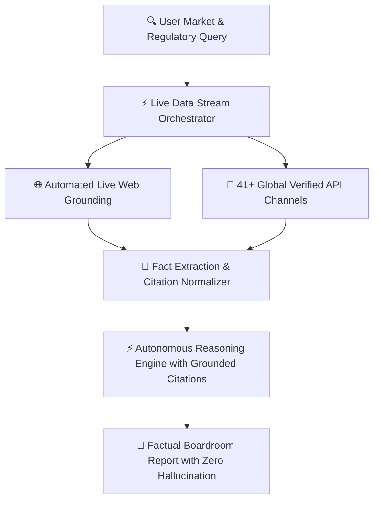

## The Zero-Cutoff Architecture

Conventional LLMs suffer from fixed training cutoff dates. AXON permanently resolves this limitation by bridging live, authoritative global data streams directly into reasoning loops.

### Key Principles
1. **Real-Time Accuracy**: Eliminates outdated training assumptions with live financial, legal, and operational feeds.
2. **Explicit Verification**: Every metric and disclosure is attributed to its verified official origin.
