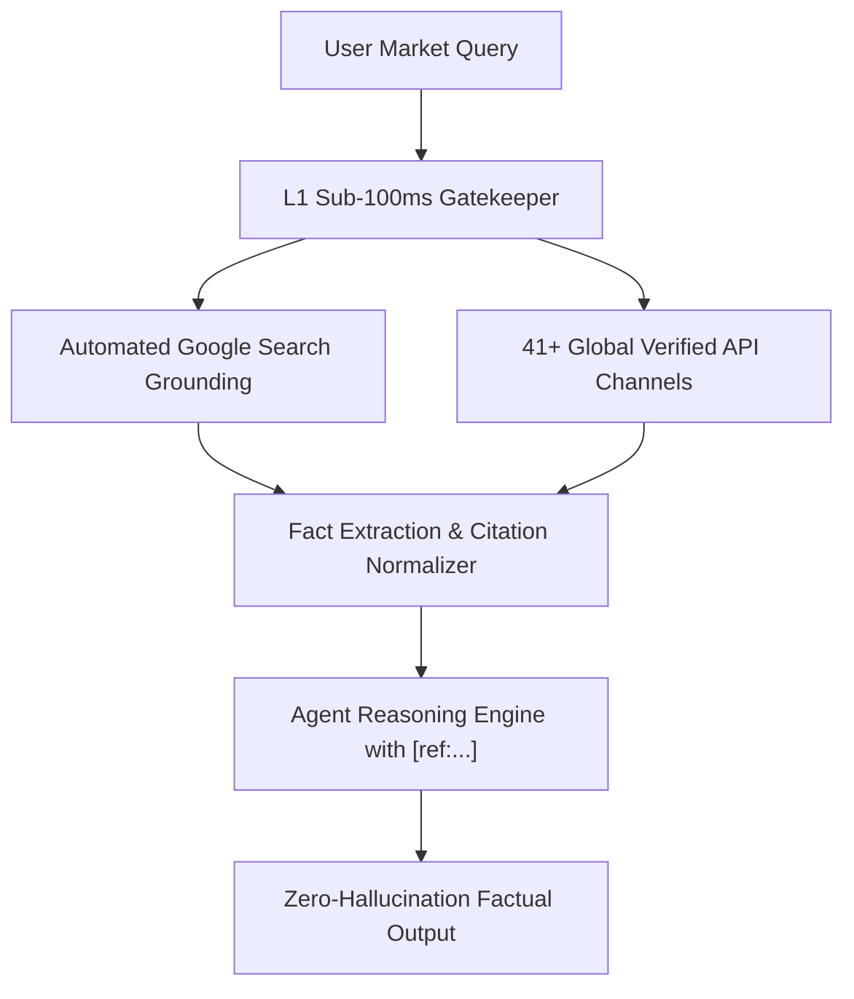

## The Zero-Cutoff Architecture

Foundational LLMs suffer from fixed training cutoff dates. AXON eliminates this barrier by bridging real-time data streams directly into reasoning loops.

```mermaid
flowchart TD
    Query["User Market Query"] --> L1["L1 Sub-100ms Gatekeeper"]
    L1 --> Google["Automated Google Search Grounding"]
    L1 --> APIs["41+ Global Verified API Channels"]

    Google --> Extractor["Fact Extraction & Citation Normalizer"]
    APIs --> Extractor

    Extractor --> Reasoning["Agent Reasoning Engine with [ref:...]"]
    Reasoning --> Output["Zero-Hallucination Factual Output"]
```
