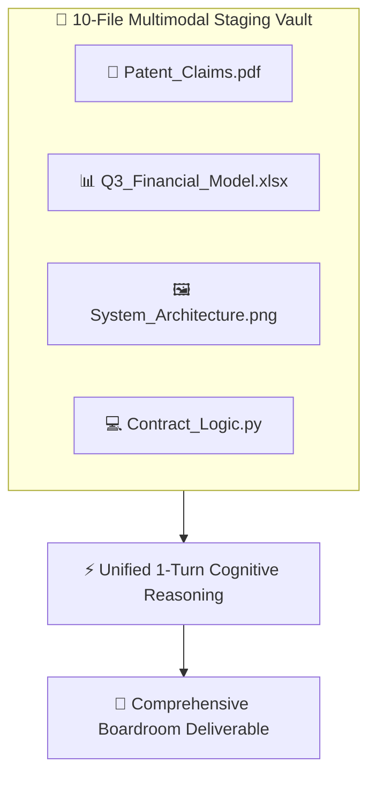

## Supported File Categories & Exhaustive Formats

AXON supports native multimodal ingestion across **6 core file categories** with strict zero-loss guarantees:

| Category | Supported Format Extensions | Single-File Limit | Policy & Pre-processing |
| :--- | :--- | :--- | :--- |
| **Documents** | `PDF`, `TXT`, `MD`, `MDX`, `HTML`, `HTM` | **30MB / 300 pages** | Word (`DOCX`), PowerPoint (`PPTX`), and Hangul (`HWP`) must be converted to **PDF** prior to upload. |
| **Spreadsheets & Tabular Data** | `XLSX`, `XLS`, `CSV`, `TSV`, `PARQUET` | **30MB** | Direct vector & formula parsing. |
| **Code & Configuration** | `PY`, `JS`, `TS`, `TSX`, `JSX`, `VUE`, `CSS`, `SCSS`, `JSON`, `JSONL`, `YAML`, `YML`, `SQL`, `SH`, `BASH`, `XML`, `TOML`, `JAVA`, `GO`, `RS`, `INI`, `CONF` | **30MB** | High-density semantic AST code indexing. |
| **Images & Visuals** | `PNG`, `JPG`, `JPEG`, `WEBP`, `HEIC`, `HEIF`, `BMP`, `TIFF`, `SVG` | **10MB** | Ultra-high-resolution multimodal vision analysis. |
| **Audio & Voice** | `MP3`, `WAV`, `AAC`, `OGG`, `FLAC`, `AIFF` | **50MB** | Whisper-based automatic transcription & semantic indexing. |
| **Video & Recordings** | `MP4`, `MOV`, `AVI`, `WEBM`, `MPEG`, `MPG`, `WMV`, `3GPP` | **50MB** | Multimodal visual frame & audio track extraction. |

<Note>
**The PDF Pre-Processing Policy**: To eliminate server-side layout skew, dropped table cells, and AI hallucinations from raw office files, AXON strictly requires Word (`.docx`), PowerPoint (`.pptx`), and Hangul (`.hwp`) documents to be baked to **PDF** prior to uploading. See [Why Office Files Must Be Converted to PDF](/data/why-pdf-conversion) for full architectural details.
</Note>

---

## 10-File Multi-Context Turn Staging

In the **Right Context Tools Panel**, users can select up to **10 files simultaneously** across any combination of categories for a single reasoning turn:

### The Power of Multimodal Staging
* **Direct Token Stream**: Files are ingested with zero OCR degradation and structured mathematical precision.
* **Complex Data Fusion**: Cross-examine a corporate legal PDF, an Excel valuation model, and an architectural diagram in a single conversation turn.
