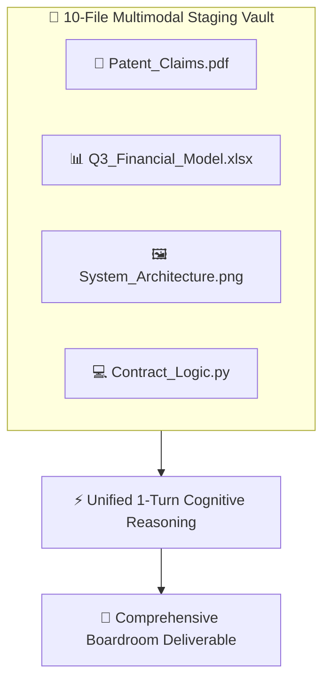

## Supported File Categories & Exhaustive Formats

AXON supports native multimodal ingestion across **7 major file categories** without requiring external third-party conversion tools:

| Category | Supported Format Extensions | Single-File Limit |
| :--- | :--- | :--- |
| **Documents & Slides** | `PDF`, `DOCX`, `DOC`, `TXT`, `MD`, `MDX`, `PPTX`, `PPT`, `HTML`, `RTF` | **30MB / 300 pages** |
| **Spreadsheets & Data** | `XLSX`, `XLS`, `CSV`, `TSV`, `PARQUET`, `NPY`, `NPZ` | **30MB** |
| **Code & Config** | `PY`, `IPYNB`, `JS`, `MJS`, `TS`, `TSX`, `JSX`, `CSS`, `SCSS`, `JSON`, `YAML`, `YML`, `TOML`, `INI`, `ENV`, `SQL`, `SH`, `DOCKERFILE` | **30MB** |
| **Images & Graphics** | `PNG`, `JPG`, `JPEG`, `WEBP`, `SVG`, `GIF`, `ICO`, `HEIC`, `HEIF` | **10MB** |
| **Audio & Recordings** | `MP3`, `WAV`, `M4A`, `AAC`, `OGG` | **50MB** |
| **Video & Screencasts** | `MP4`, `MOV`, `WEBM`, `AVI`, `MPEG` | **50MB** |
| **Archives & Packages** | `ZIP`, `TAR`, `GZ`, `RAR` | **50MB** |

---

## 10-File Multi-Context Turn Staging

In the **Right Context Tools Panel**, users can select up to **10 files simultaneously** across any combination of categories for a single reasoning turn:

### The Power of Multimodal Staging
* **Direct Token Stream**: Files are ingested with zero OCR degradation and structured mathematical precision.
* **Complex Data Fusion**: Cross-examine a corporate legal PDF, an Excel valuation model, and an architectural diagram in a single conversation turn.
