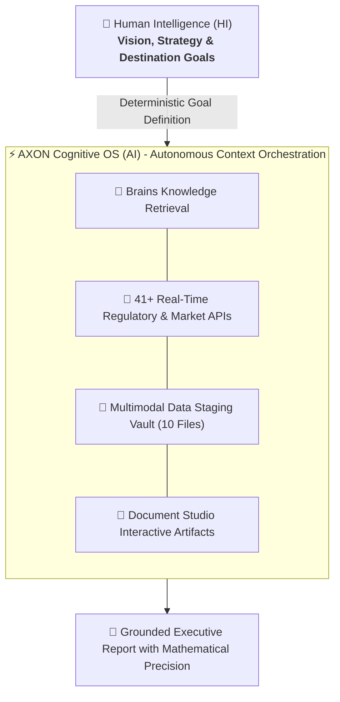

## The Core Friction of Generative AI 1.0

Generative AI 1.0 forced humans into becoming "prompt engineers"—spending hours tweaking magical keywords, copy-pasting text across isolated browser tabs, and constantly battling hallucinations.

## The Tesla FSD Analogy: Vision vs. Context

Just as **Tesla's Full Self-Driving (FSD)** navigates complex real-world road intersections autonomously once the destination is chosen:
* **Humans (HI)** define high-level strategic vision, goals, and business decisions.
* **AXON Cognitive OS (AI)** autonomously and deterministically orchestrates the entire context—fetching live financial filings, indexing proprietary documents, and executing multi-step reasoning to reach the destination with mathematical certainty.

## The 3 Pillars of AI 2.0

1. **Deterministic Over Probabilistic**: Exact schemas and immutable native execution govern data retrieval and calculations.
2. **Zero-Hallucination Grounding**: Every fact is explicitly attributed to a verified source (`[ref:Source]`).
3. **Data Sovereignty by Design**: Multi-region database isolation permanently protects enterprise IP.
