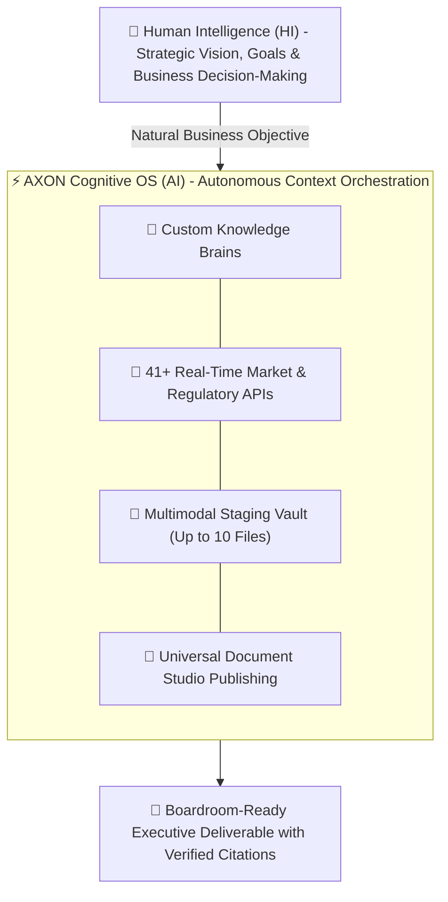

## The Paradigm Shift: From AI 1.0 to AI 2.0

The early wave of generative AI (**AI 1.0**) placed an immense cognitive burden on enterprise professionals. Users were forced to become "prompt engineers"—spending hours tweaking magical keywords, copy-pasting text across fragmented browser tabs, and constantly verifying whether generated figures were factual or hallucinated.

**AI 2.0** represents a fundamental transition from **probabilistic text guessing** to **deterministic context orchestration**.

---

## The Tesla FSD Analogy: Human Vision vs. Machine Context

Consider the evolution of autonomous driving:

* **Level 2 Driver Assistance (AI 1.0)**: The driver must constantly keep their hands on the wheel, micro-managing lane changes, braking distances, and navigation prompts.
* **Full Self-Driving / FSD (AI 2.0)**: The human simply specifies the **Destination**. The vehicle autonomously executes sensory fusion (cameras, radar, maps), real-time path planning, obstacle avoidance, and precise navigation to reach the destination safely.

### The Division of Intelligence
* **Human Intelligence (HI)**: Retains 100% sovereignty over strategic vision, priority setting, creative intent, and ultimate business sign-off.
* **AXON Cognitive OS (AI)**: Autonomously orchestrates the entire context layer—extracting proprietary domain terminology, querying live regulatory filings, staging spreadsheets, and assembling structured executive artifacts.

---

## Generative AI 1.0 vs. AXON AI 2.0

| Architectural Dimension | Generative AI 1.0 (Chatbot Era) | AXON AI 2.0 (Cognitive OS Era) |
| :--- | :--- | :--- |
| **Interaction Model** | Fragile prompt engineering & keyword hacking | Natural business goal + 1-click context toggles |
| **Data Currency** | Fixed training cutoff dates (Stale knowledge) | **41+ Real-Time Live APIs** (SEC, DART, FRED, FX) |
| **Fact Verification** | Unverified probabilistic text generation | Strict **`[ref:Source]`** clickable citations |
| **Deliverable Format** | Ephemeral text trapped in chat bubbles | **Document Studio** (Standalone HTML & A4 PDF) |
| **Multi-Agent Collaboration** | Single sequential chat thread | **Symposium** autonomous Delphi debate panels |
| **Voice Interaction** | Robotic turn-taking voice notes | **Talk** sub-300ms brain-embodied voice streaming |
| **Data Sovereignty** | Public cloud model training risks | **Zero-Training Guarantee** & Regional Isolation |

---

## The 3 Invariants of the AI 2.0 Enterprise Standard

<CardGroup cols={3}>
  <Card title="1. Context Over Keywords" icon="layer-group">
    Instead of writing 500-word prompt wrappers, users simply select their custom Brain, toggle live APIs, and stage data files in the UI. AXON automatically resolves the context.
  </Card>
  <Card title="2. Zero-Hallucination Grounding" icon="badge-check">
    Every metric, financial figure, and regulatory clause is explicitly grounded with interactive source badges (`[ref:Source]`), giving legal and compliance teams immediate auditability.
  </Card>
  <Card title="3. Sovereign by Design" icon="shield-halved">
    Enterprise data residency is strictly isolated by jurisdiction (South Korea PIPA vs. US/Global CCPA/GDPR), ensuring customer IP is never used for public model training.
  </Card>
</CardGroup>

---

## Next Steps

<CardGroup cols={2}>
  <Card title="Workspace Anatomy & Navigation" icon="table-columns" href="/get-started/workspace-overview">
    Explore the 3-column layout: Left Sessions Drawer, Central Canvas, and Right Context Panel.
  </Card>
  <Card title="1-Turn Tool Symphony" icon="sliders" href="/agent/tools-orchestration">
    Learn how to bind custom Brains, live SEC filings, and proprietary Excel spreadsheets in a single turn.
  </Card>
</CardGroup>
