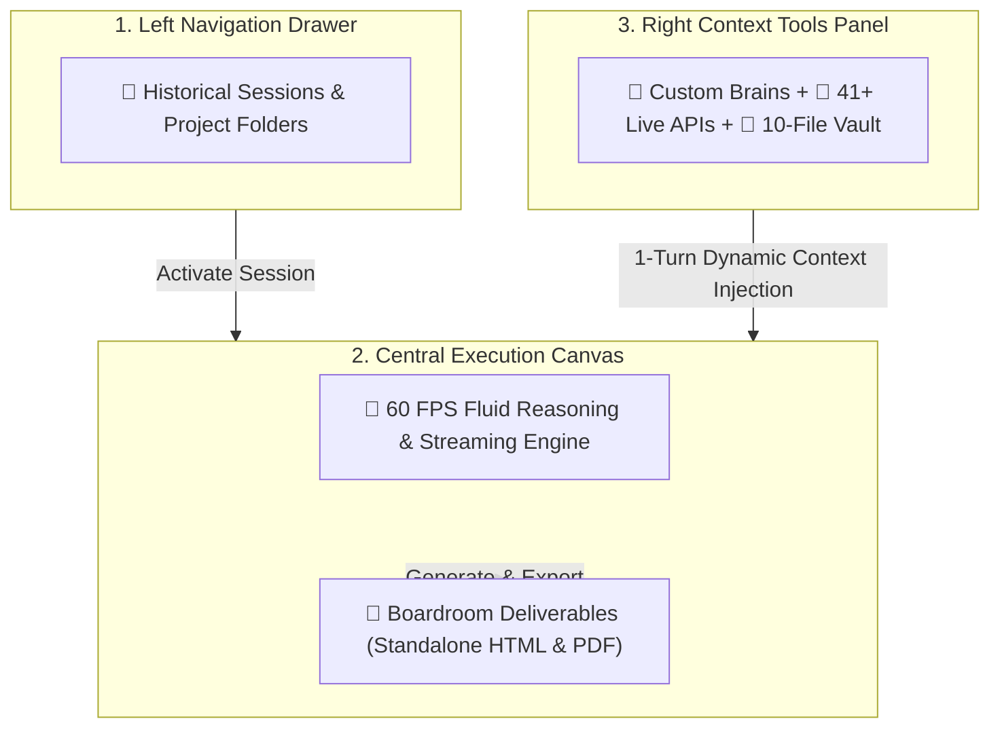

## The Unified 3-Column Interface

AXON is built upon an ergonomic, high-density 3-column workspace designed to keep complex enterprise context accessible without cluttering your cognitive flow.

<CardGroup cols={3}>
  <Card title="1. Left Navigation Drawer" icon="sidebar">
    * **➕ New Chat Session**: Instant unpolluted cognitive thread (`Cmd + Shift + O`)
    * **📁 Folder Tree**: Categorized nested project hierarchies
    * **🔍 Session Search**: Real-time keyword filter (`Cmd + K`)
    * **⚡ Task Monitor**: Autonomous background research runners
  </Card>
  <Card title="2. Central Execution Canvas" icon="window">
    * **🧭 Top App Switcher**: Fluid jump across the 7 core apps
    * **💬 60 FPS Fluid Stream**: Zero-stutter streaming text engine
    * **💭 Thinking Trace**: Collapsible multi-step reasoning trace
    * **📄 Action Bar**: Standalone HTML & executive PDF export
  </Card>
  <Card title="3. Right Context Tools Panel" icon="sliders">
    * **🧠 Brains Selector**: Attach domain expert neural hubs
    * **📡 41+ Live APIs**: SEC EDGAR, DART, FDA, FRED, Crypto
    * **📁 10-File Vault**: Multimodal document & data staging
    * **⚙️ Reasoning Mode**: Instant toggle between Flash & Think
  </Card>
</CardGroup>

---

## 1. Left Navigation Drawer (Sessions & Structure)

The Left Drawer manages your historical context, project organization, and long-running background tasks.

<CardGroup cols={2}>
  <Card title="New Chat & Quick Launch" icon="plus">
    Instantly start an unpolluted cognitive session with a single click or keyboard shortcut (`Cmd + Shift + O`).
  </Card>
  <Card title="Categorized Folder Hierarchy" icon="folder-tree">
    Organize client deliverables, department chats, and deep research topics into nested, color-coded project folders.
  </Card>
  <Card title="Instant Global Search" icon="magnifying-glass">
    Search across historical conversations, session titles, and referenced document names in real time (`Cmd + K`).
  </Card>
  <Card title="Background Task Monitor" icon="circle-notch">
    Track the real-time execution status of autonomous deep-research tasks while working in parallel threads.
  </Card>
</CardGroup>

---

## 2. Central Execution Canvas (Interactive Workspace)

The Central Canvas is the core cognitive interaction space where ideas transform into boardroom deliverables.

### Anatomy of the Central Canvas

| UI Element | Functional Role | Operational Value |
| :--- | :--- | :--- |
| **Top Application Switcher** | Seamlessly switch between the 7 core apps | Jump from **Agent** to **Symposium** or **Document Studio** with shared context |
| **Sovereign Region Badge** | Visual indicator of active datacenter (`KR / US`) | Constant legal verification of data isolation |
| **60 FPS Fluid Stream** | High-velocity streaming text engine | Zero-stutter rendering with intelligent scroll lock |
| **Collapsible Thinking Block** | Transparent multi-step reasoning trace | Inspect the step-by-step logic and hypothesis validation |
| **Action Bar** | Instant document operations | **Copy All**, **Clear**, **Download Standalone HTML**, **Export / Print PDF** |
| **Multi-Format Input Bar** | Goal submission & reasoning mode switch | Toggle between **Flash Mode** and **Think Mode** |

<Note>
**Zero Page-Split PDF Guarantee**: When using the Action Bar's **Export PDF** button, AXON applies intelligent `@media print` rules, ensuring tables, charts, and diagrams are never awkwardly severed across page breaks.
</Note>

---

## 3. Right Context Tools Panel (1-Turn Symphony)

The Right Panel is your dynamic context console, allowing you to selectively activate external data sources per conversation turn.

<Tabs>
  <Tab title="🧠 Brains Selector">
    - Attach specialized enterprise neural hubs (e.g., *Legal Review Brain*, *Corporate Finance Hub*).
    - Ingests bespoke organizational heuristics, terminology, and evaluation rules into the prompt turn.
  </Tab>

  <Tab title="📡 41+ Live APIs">
    - Selectively toggle real-time regulatory and financial data feeds:
      - **Regulatory Feeds**: SEC EDGAR 10-K/10-Q filings, Korea DART disclosures, FDA drug approvals.
      - **Market & Macro Feeds**: Real-time FX rates, FRED macroeconomic indicators, Yahoo Finance, Crypto.
      - **Knowledge Feeds**: ArXiv scientific preprints, PubMed biomedical literature, Wikipedia grounding.
  </Tab>

  <Tab title="📁 Data Files Staging">
    - Select up to **10 files** simultaneously from your Multimodal Vault.
    - **Supported Formats Across 6 Native Categories**:
      - **Documents**: `PDF`, `TXT`, `MD`, `MDX`, `HTML`, `HTM` *(Office files like `DOCX`, `PPTX`, `HWP` must be baked to `PDF` before upload for 100% loss-free visual grounding)*
      - **Spreadsheets & Tabular Data**: `XLSX`, `XLS`, `CSV`, `TSV`, `PARQUET`
      - **Code & Configuration**: `PY`, `JS`, `TS`, `TSX`, `JSX`, `VUE`, `CSS`, `SCSS`, `JSON`, `JSONL`, `YAML`, `YML`, `SQL`, `SH`, `BASH`, `XML`, `TOML`, `JAVA`, `GO`, `RS`, `INI`, `CONF`
      - **Images & Graphics**: `PNG`, `JPG`, `JPEG`, `WEBP`, `HEIC`, `HEIF`, `BMP`, `TIFF`, `SVG`
      - **Audio & Voice**: `MP3`, `WAV`, `AAC`, `OGG`, `FLAC`, `AIFF`
      - **Video & Recordings**: `MP4`, `MOV`, `AVI`, `WEBM`, `MPEG`, `MPG`, `WMV`, `3GPP`
    - Directly fuses internal financial models, research PDFs, patents, and datasets into the active reasoning loop.
  </Tab>
</Tabs>

---

## Responsive Layout Controls

* **Collapsible Sidebars**: Click the sidebar collapse icons (or press `Cmd + /`) to expand the central canvas into a distraction-free, full-width document workspace.
* **Dual Theme Parity**: Toggle between **Solid Navy Mirage (Light)** and **Translucent Frost Glass (Dark)** using the top-right sun/moon icon.

---

## Next Steps

<CardGroup cols={2}>
  <Card title="1-Turn Tool Symphony" icon="sliders" href="/agent/tools-orchestration">
    Deep-dive into combining custom Brains, 41+ live APIs, and 10 data files in a single turn.
  </Card>
  <Card title="Document Studio & PDF Export" icon="file-pdf" href="/studio/document-viewer">
    Learn how Document Studio generates standalone interactive HTML bundles and executive PDF prints.
  </Card>
</CardGroup>
