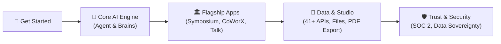

## Where Human Vision Meets Machine Context

Welcome to **Gōsuto X Inc.** and the **AXON Cognitive Operating System**. 

AXON is the flagship platform designed to bridge the chasm between raw large language models and mission-critical enterprise execution. Without tedious prompt engineering, AXON seamlessly orchestrates specialized agent reasoning, custom document Brains, real-time Google Grounding, and 41+ live regulatory and market APIs into an intuitive desktop experience.

<CardGroup cols={2}>
  <Card title="3-Minute Quickstart" icon="bolt" href="/get-started/quickstart">
    Get up and running from your first login to generating a boardroom-ready report.
  </Card>
  <Card title="The AI 2.0 Standard" icon="compass" href="/get-started/philosophy-ai2">
    Understand why zero-prompting and the Tesla FSD analogy redefine AI productivity.
  </Card>
  <Card title="AXON Agent Master Guide" icon="robot" href="/agent/overview">
    Master the central cognitive execution heart: sessions, folders, and multi-tool orchestration.
  </Card>
  <Card title="Symposium: Multi-Agent Debate" icon="landmark" href="/symposium/overview">
    Discover industry-first autonomous agent debate and consensus report generation.
  </Card>
  <Card title="CoWorX: Collaborative Canvas" icon="users-gear" href="/coworx/overview">
    Summon custom personal Brain agents into real-time team messenger channels.
  </Card>
  <Card title="Talk: Brain-Embodied Voice" icon="microphone" href="/talk/overview">
    Experience sub-300ms real-time voice streaming embodied with bespoke knowledge Brains.
  </Card>
  <Card title="41+ Live Data Antennas" icon="tower-broadcast" href="/data/41-global-api-channels">
    Explore live SEC EDGAR, DART, FX, macro data, and copy-paste prompt templates.
  </Card>
  <Card title="Document Studio & PDF Export" icon="file-pdf" href="/studio/document-viewer">
    Generate standalone production HTML bundles and pixel-perfect executive PDF prints.
  </Card>
</CardGroup>

---

## 5 Core Navigation Pillars

