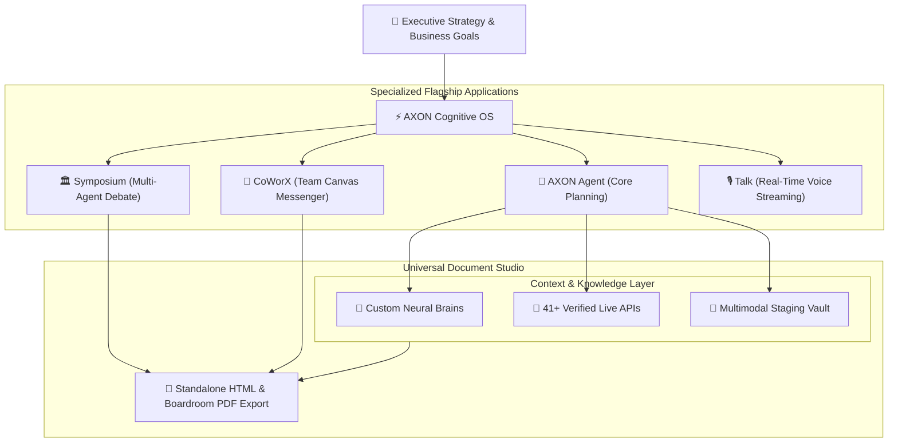

## Where Human Vision Meets Machine Context

Welcome to **Gōsuto X Inc.** and the **AXON Cognitive Operating System**.

AXON is the enterprise platform engineered to bridge the fundamental gap between raw probabilistic AI models and mission-critical corporate execution. Moving decisively beyond the trial-and-error friction of prompt engineering, AXON autonomously unifies **specialized neural reasoning**, **custom proprietary Brains**, **41+ real-time regulatory and market APIs**, and **multimodal document staging** into an authoritative, boardroom-ready desktop environment.

---

## Explore the 5 Architectural Pillars

Navigate through the comprehensive technical and operational documentation of the AXON ecosystem:

<CardGroup cols={2}>
  <Card title="1. Get Started" icon="rocket" href="/get-started/quickstart">
    Begin with the 3-minute executive onboarding, understand the AI 2.0 paradigm, and master the 3-column workspace anatomy.
  </Card>
  <Card title="2. Core AI Engine" icon="brain" href="/agent/overview">
    Master the central cognitive heart: multi-step autonomous planning, folder governance, 1-turn tool orchestration, and Brains Studio.
  </Card>
  <Card title="3. Flagship Applications" icon="shapes" href="/symposium/overview">
    Explore the 3 dedicated execution engines: **Symposium** (Multi-Agent Debate), **CoWorX** (Team Canvas), and **Talk** (Voice Streaming).
  </Card>
  <Card title="4. Live Data & Document Studio" icon="chart-network" href="/data/live-data-architecture">
    Leverage 41+ real-time global market APIs, 10-file multimodal staging vault, and export pixel-perfect standalone HTML/PDF reports.
  </Card>
</CardGroup>

<CardGroup cols={1}>
  <Card title="5. Enterprise Trust, Governance & Data Sovereignty" icon="shield-check" href="/trust/data-sovereignty">
    Review strict regional database isolation (South Korea PIPA vs. US/Global CCPA/GDPR), zero-model-training legal invariants, and mathematical token economics.
  </Card>
</CardGroup>

---

## The 7 Core Flagship Applications

AXON operates as a unified cognitive operating system powering 7 interconnected application modules:

| Flagship Module | Core Cognitive Role | Primary Inputs | Boardroom Deliverable |
| :--- | :--- | :--- | :--- |
| **AXON Agent** | Central Strategic Orchestration Heart | Natural Language Goal, Brains, APIs, Files | Interactive Executive Synthesis |
| **Brains Studio** | Bespoke Enterprise Knowledge Hubs | PDF/Docx Knowledge, Persona Directives | Reusable Domain Neural Experts |
| **AXON Symposium** | Autonomous Multi-Agent Delphi Panel | Strategic Business Proposition | Unbiased Multi-Angle Consensus Report |
| **AXON CoWorX** | Real-Time Team Canvas & Messenger | Team Dialogues, Summoned Personal Brains | Collaborative Live Document Canvas |
| **AXON Talk** | Brain-Embodied Real-Time Voice OS | Low-Latency Audio Streaming, Custom Personas | Hands-Free Interactive Voice Insights |
| **Live Data Antennas** | 41+ Real-Time Market & Regulatory Feeds | SEC EDGAR, DART, FRED, Global Markets | Verified Fact Citations (`[ref:...]`) |
| **Document Studio** | Pixel-Perfect Visual Publishing Engine | Markdown Artifacts, Tables, Visual Charts | Standalone HTML & Multi-Page PDF |

---

## Enterprise Execution Ecosystem

---

## Tailored Documentation Journeys

<Tabs>
  <Tab title="For Executives & Leaders">
    - **[The AI 2.0 Standard & Tesla FSD Analogy](/get-started/philosophy-ai2)**: Understand why zero-prompting and deterministic context orchestration define enterprise ROI.
    - **[Multi-Region Data Sovereignty](/trust/data-sovereignty)**: Review isolated regional storage infrastructure for South Korea (PIPA) and US/Global (CCPA/GDPR).
    - **[Zero-Training Legal Guarantee](/trust/zero-training-guarantee)**: Explore absolute data privacy protections ensuring proprietary enterprise IP is never used for model training.
  </Tab>

  <Tab title="For Analysts & Strategists">
    - **[3-Minute Quickstart Guide](/get-started/quickstart)**: Sign in, configure your workspace, and generate your first comprehensive market brief.
    - **[1-Turn Tool Symphony](/agent/tools-orchestration)**: Learn how to bind custom Brains, live SEC filings, and proprietary Excel spreadsheets in a single turn.
    - **[41+ Verified Live APIs](/data/41-global-api-channels)**: Access copy-paste prompts for financial statements, macroeconomic indicators, and trade databases.
  </Tab>

  <Tab title="For Teams & Operations">
    - **[AXON Symposium Autonomous Panels](/symposium/overview)**: Configure 4-expert multi-agent debate panels for uncompromised risk assessments.
    - **[AXON CoWorX Live Collaboration](/coworx/overview)**: Summon personal Brains into shared team channels and co-author living documents.
    - **[AXON Talk Hands-Free Voice](/talk/overview)**: Conduct natural, interruptible voice conversations embodied with specialized enterprise knowledge.
  </Tab>
</Tabs>
