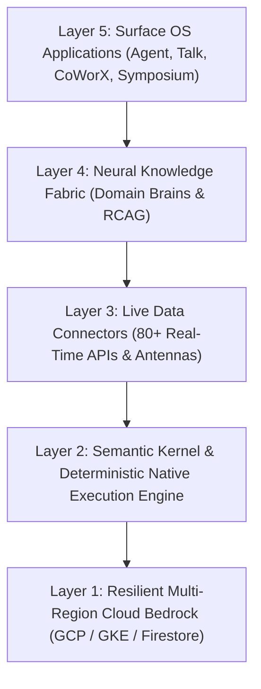

## Overview

AXON is engineered as a **5-Layer Cognitive Operating System** designed to bridge the chasm between raw large language models and mission-critical business execution.

### The Tesla FSD Analogy
Just as Tesla's Full Self-Driving (FSD) navigates complex roads autonomously once the destination is set, humans define the strategic vision while AXON deterministically orchestrates context, verifies facts, and executes operations.
