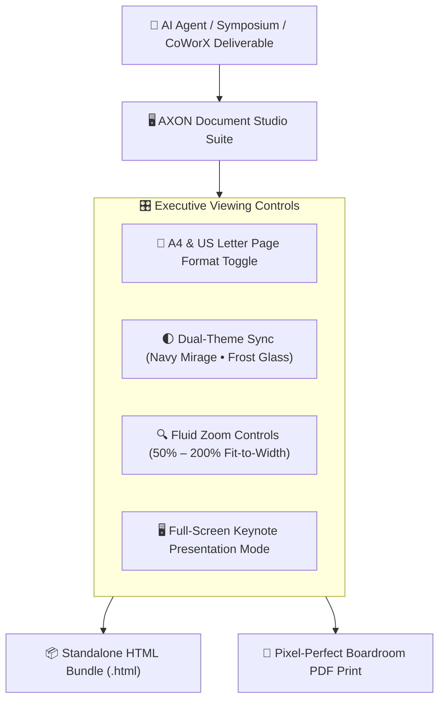

## The Executive Publishing Suite

Traditional AI chat interfaces trap critical deliverables in narrow, ephemeral message streams. Reading multi-page financial models or legal risk matrices inside a chat bubble creates severe cognitive fatigue.

**AXON Document Studio** provides a dedicated, full-screen publishing and presentation environment. It transforms raw AI markdown outputs and interactive HTML code into boardroom-ready documents:

---

## 4 Core Capabilities of Document Studio

<CardGroup cols={2}>
  <Card title="A4 & US Letter Viewport Toggle" icon="file">
    Instantly switch between international **ISO A4 (210 × 297 mm)** and North American **US Letter (8.5 × 11 in)** dimensions to preview exact print layouts before physical distribution.
  </Card>
  <Card title="Dual-Theme Synchronization" icon="circle-half-stroke">
    Toggle between **Solid Steel Navy Mirage (Light Mode)** for crisp daytime reading and **Translucent Frost Glass (Dark Mode)** for low-light boardroom presentations.
  </Card>
  <Card title="Fluid Zoom & Fit Controls" icon="magnifying-glass-plus">
    Scale document preview smoothly from **50% to 200%** or click **Fit to Width** for distraction-free executive proofreading.
  </Card>
  <Card title="Full-Screen Keynote Mode" icon="expand">
    Present generated interactive slide decks and dashboards full-screen with keyboard navigation (`←` / `→`) and animated slide transitions.
  </Card>
</CardGroup>

---

## Anatomy of the Document Studio Toolbar

The top toolbar in Document Studio provides instant access to publishing controls:

| Control Button | Keyboard Shortcut | Functionality |
| :--- | :--- | :--- |
| **Page Format (A4 / Letter)** | `Cmd + Shift + P` | Toggles paper viewport dimensions for print accuracy |
| **Theme Toggle (Light / Dark)** | `Cmd + Shift + T` | Synchronizes document typography and background palette |
| **Zoom In / Out / Reset** | `Cmd + +` / `Cmd + -` / `Cmd + 0` | Adjusts zoom scale smoothly with persistent state |
| **Download HTML** | `Cmd + S` | Exports a self-contained, zero-dependency `.html` bundle |
| **Print / Export PDF** | `Cmd + P` | Triggers the Two-Pass PDF print engine with zero page-split truncation |

---

## Next Steps

<CardGroup cols={2}>
  <Card title="Standalone HTML Bundle Export" icon="code" href="/studio/html-download">
    Learn how single-file HTML bundles operate offline across any browser or OS.
  </Card>
  <Card title="Pixel-Perfect PDF Printing Engine" icon="file-pdf" href="/studio/pdf-printing-engine">
    Understand the two-pass rendering sweep ensuring clean page breaks and corporate watermarks.
  </Card>
</CardGroup>
