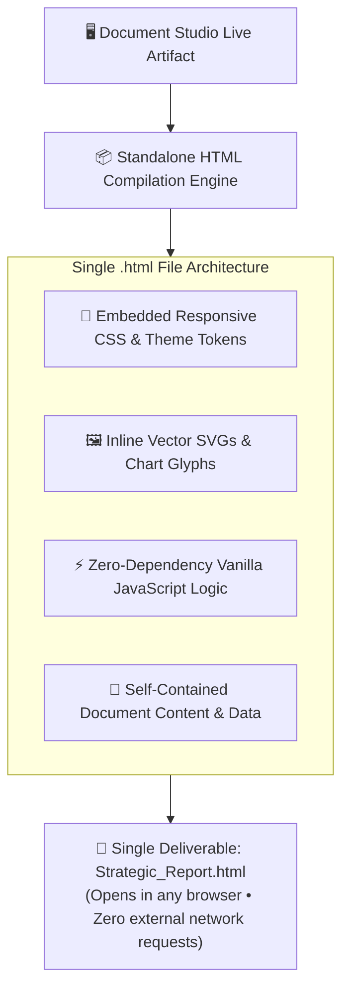

## The Zero-Dependency HTML Bundle Standard

Enterprise documents often require interactive capabilities—such as dynamic valuation sliders, expandable legal appendices, and animated charts—that static PDF documents cannot support. However, traditional web apps require backend servers, user accounts, and active internet access.

**AXON's Standalone HTML Bundler** bridges this gap. When you click **Download HTML** in Document Studio, AXON compiles all layout structures, CSS tokens, SVG graphics, and JavaScript logic into a **single, standalone `.html` file**:

---

## 4 Key Enterprise Advantages

<CardGroup cols={2}>
  <Card title="Zero Server & CDN Dependencies" icon="server">
    Contains zero external script tags or remote CSS links. The file opens instantly in Chrome, Safari, Edge, or Firefox without internet access.
  </Card>
  <Card title="Frictionless Client Sharing" icon="share-nodes">
    Email the `.html` file as a single attachment or share via Slack/Teams. Clients double-click the file to experience the full interactive dashboard.
  </Card>
  <Card title="Air-Gapped & Secure Execution" icon="shield-halved">
    Executes in a sandboxed local browser environment with zero outbound tracking, telemetry, or external network requests.
  </Card>
  <Card title="Cross-Platform Responsive Parity" icon="laptop-mobile">
    Automatically adapts to desktop monitors, iPad Pro tablets, and smartphone screens with responsive viewport media queries.
  </Card>
</CardGroup>

---

## What Types of Deliverables Benefit from HTML Bundles?

| Deliverable Type | Key Interactive Feature | User Value |
| :--- | :--- | :--- |
| **Interactive Keynote Slide Decks** | Keyboard arrow navigation (`←`/`→`), full-screen toggle | Deliver smooth executive presentations without PowerPoint software |
| **Financial & SaaS ROI Calculators** | Interactive input sliders, dynamic scenario toggles | Allow clients and board members to adjust assumptions in real time |
| **Gantt Timelines & Roadmaps** | Clickable phase filters, milestone detail popovers | Explore complex multi-year project dependencies interactively |
| **Multi-Tab Executive Audits** | Tabbed perspective switching (`Legal` / `Finance` / `Tech`) | Package hundreds of pages of analysis into a clean tabbed UI |

---

## Next Steps

<CardGroup cols={2}>
  <Card title="Pixel-Perfect PDF Printing Engine" icon="file-pdf" href="/studio/pdf-printing-engine">
    Learn how AXON's two-pass print sweep guarantees boardroom-quality multi-page PDF documents.
  </Card>
  <Card title="Enterprise Trust & Security" icon="shield-check" href="/trust/data-sovereignty">
    Explore AXON's SOC 2 compliance, multi-region data sovereignty, and zero-training guarantees.
  </Card>
</CardGroup>
