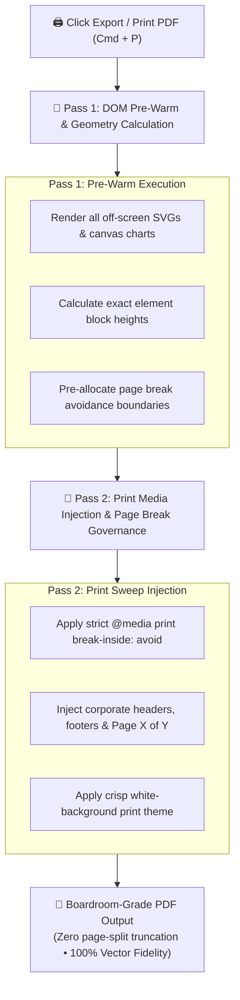

## Eliminating the Broken Print Problem

Standard browser printing (`window.print()`) is notorious for destroying complex documents: financial tables are sliced in half across page boundaries, off-screen SVG charts fail to render, and dark-mode themes consume gallons of toner with unreadable inverted text.

**AXON's Two-Pass PDF Printing Engine** solves this problem permanently. Built specifically for C-suite deliverables and board meetings, it executes an automated two-pass pre-flight sweep before compiling the final PDF:

---

## The Two-Pass Rendering Sweep Explained

<CardGroup cols={2}>
  <Card title="Pass 1: Pre-Warm & Geometry Calculation" icon="rotate">
    * **Off-Screen Asset Rasterization**: Forces lazy-loaded charts, Mermaid diagrams, and financial tables to fully paint into memory.
    * **Height Budgeting**: Measures the exact pixel height of every card, table, and callout block against target page boundaries (A4 or Letter).
  </Card>
  <Card title="Pass 2: Print Media Injection & Governance" icon="print">
    * **Intelligent Page Breaks**: Automatically pushes oversized tables or diagrams to the top of the next page, eliminating awkward row splits.
    * **Corporate Header & Footer**: Injects official document titles, confidentiality notices, timestamp watermarks, and dynamic page counters (`Page 1 of 8`).
    * **Toner-Optimized Palette**: Automatically converts dark-theme backgrounds to pristine white with high-contrast black typography.
  </Card>
</CardGroup>

---

## 4 Zero-Defect Print Guarantees

| Guarantee Dimension | Technical Implementation | Operational Outcome |
| :--- | :--- | :--- |
| **Zero Table Splitting** | `break-inside: avoid; page-break-inside: avoid;` | Financial balance sheets and cap tables always remain intact on a single page |
| **Zero Chart Clipping** | Full vector SVG preservation | Charts, graphs, and network diagrams print in ultra-high 300 DPI vector clarity |
| **Zero Missing Off-Screen Content** | Pre-print virtual DOM expansion | Multi-page reports with 20+ pages render 100% of content without omissions |
| **Zero Toner Waste** | Automated light-mode print stylesheets | Clean, crisp monochrome and subtle accent colors suitable for physical board packs |

---

## How to Export Boardroom PDFs

1. In **Document Studio** (or in the Action Bar of Agent/Symposium/CoWorX), click the **Export PDF** button or press `Cmd + P`.
2. The print preview opens with exact A4 or Letter pagination already computed.
3. Select **Save as PDF** in your browser's print destination to generate the final file.

---

## Next Steps

<CardGroup cols={2}>
  <Card title="Multi-Region Data Sovereignty" icon="shield-halved" href="/trust/data-sovereignty">
    Learn how AXON isolates enterprise data across South Korea (PIPA) and US/Global (GDPR/CCPA) regions.
  </Card>
  <Card title="Zero-Training Legal Guarantee" icon="lock" href="/trust/zero-training-guarantee">
    Review our contractual commitment that your proprietary data is never used to train AI models.
  </Card>
</CardGroup>
