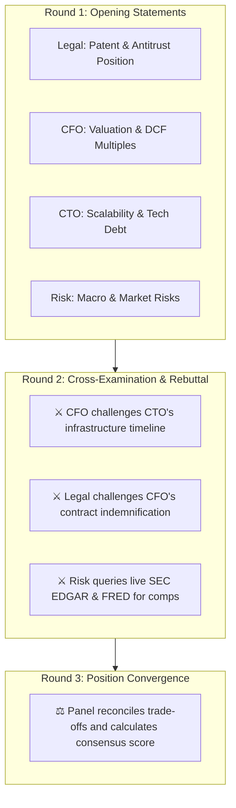

## The Autonomous Deliberation Engine

Once seated, the Symposium panel deliberates autonomously without requiring turn-by-turn human prompting. Agents converse directly with one another, challenging faulty assumptions, cross-checking formulas, and defending their domain perspectives:

---

## 3 Core Debate Visualization Controls

AXON Symposium provides three synchronized real-time visualization panes:

<CardGroup cols={3}>
  <Card title="3D Force-Directed Graph" icon="cubes">
    **`SymposiumGraph3D`**
    An interactive 3D communication graph showing dynamic vector pulses between agents as arguments, rebuttals, and agreement weights flow in real time.
  </Card>
  <Card title="Debate Timeline" icon="timeline">
    **`DebateTimeline`**
    A chronological stream displaying speaker avatars, role badges, argument summaries, and highlighted claim counter-points.
  </Card>
  <Card title="Telemetry HUD" icon="gauge-high">
    **`SymposiumTelemetry`**
    Live deliberation metrics tracking total debate tokens, argument convergence index (0% to 100%), and active consensus health.
  </Card>
</CardGroup>

---

## The 3-Round Deliberation Flow

<AccordionGroup>
  <Accordion title="Round 1: Independent Opening Positions" icon="microphone">
    Each panelist reviews the mandate and shared data files independently, delivering a structured opening assessment:
    * **Primary Thesis**: Core strategic recommendation from their domain perspective.
    * **Critical Evidence**: Specific citations from attached spreadsheets or patent PDFs.
    * **Initial Risk Flags**: Potential fatal flaws or boundary violations.
  </Accordion>

  <Accordion title="Round 2: Aggressive Cross-Examination & Live Grounding" icon="swords">
    Agents directly address specific claims made by peers:
    * **Formula Auditing**: The CFO recalculates the CTO's server infrastructure costs and proves a 40% margin erosion.
    * **Regulatory Verification**: The Legal Counsel queries **SEC EDGAR** in real time, citing an active FTC enforcement precedent against peer companies.
    * **Macro Stress-Testing**: The Risk Officer pulls live **FRED inflation metrics** to test cash-flow resilience under a high-interest-rate environment.
  </Accordion>

  <Accordion title="Round 3: Concession, Trade-Offs & Convergence" icon="handshake">
    Having stress-tested all arguments, panelists adjust their positions:
    * The CTO concedes the cloud timeline risk and proposes a modular phased rollout.
    * The CFO approves the revised budget with a mandatory 15% contingency reserve.
    * The panel converges on a unanimous, risk-mitigated consensus.
  </Accordion>
</AccordionGroup>

---

## Interactive Human-in-the-Loop Interventions

While Symposium runs autonomously, human executives maintain full supervisory control:

* **Pause / Resume Deliberation**: Freeze the debate at any moment to inspect intermediate agent arguments in detail.
* **Inject Strategic Guidance**: Type a real-time prompt into the moderator input (e.g., *"Assume interest rates rise by 100 bps in Q3; how does this impact our debt covenants?"*) to steer the debate direction.
* **Force Consensus Compilation**: Immediately transition the panel to final report synthesis at any point.

---

## Next Steps

<CardGroup cols={2}>
  <Card title="Consensus Report & Document Studio" icon="file-signature" href="/symposium/consensus-report-export">
    Learn how the debate outcome is automatically packaged into a multi-page boardroom report.
  </Card>
  <Card title="AXON CoWorX: Team Collaboration" icon="comments" href="/coworx/overview">
    Explore how to bring individual Brain agents into human team channels.
  </Card>
</CardGroup>
