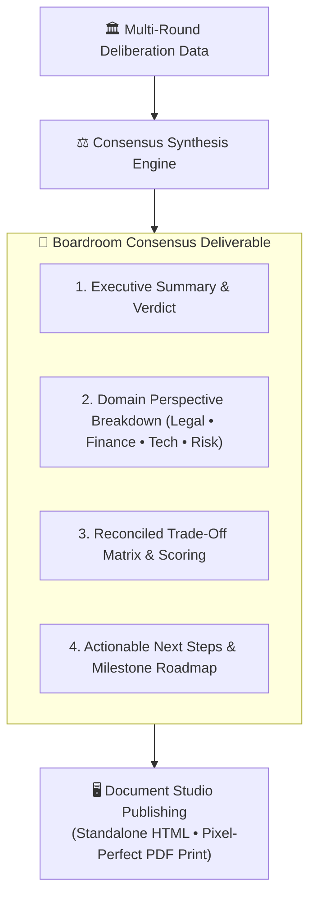

## The Consensus Deliverable Standard

The true ROI of a multi-agent debate lies in its tangible output. AXON Symposium does not leave you with a messy chat transcript; it autonomously synthesizes the entire debate into an executive **Consensus Deliverable** formatted for boardroom presentation.



---

## 4 Key Sections of the Consensus Report

<CardGroup cols={2}>
  <Card title="1. Executive Summary & Final Verdict" icon="scale-balanced">
    A clear, unequivocal go/no-go recommendation with unanimous panel agreement metrics and quantified risk probabilities.
  </Card>
  <Card title="2. Domain Perspective Breakdown" icon="users-viewfinder">
    Detailed summaries of key positions, empirical citations, and concessions made by each seated Brain during the debate.
  </Card>
  <Card title="3. Reconciled Risk & Trade-Off Matrix" icon="table">
    A high-density evaluation matrix comparing risk dimensions, mitigation requirements, and estimated financial impacts.
  </Card>
  <Card title="4. Phased Actionable Roadmap" icon="list-check">
    A step-by-step implementation plan with assigned departmental ownership, milestone dates, and contingency triggers.
  </Card>
</CardGroup>

---

## Multi-Format Export Suite (Audio & Document Studio)

<CardGroup cols={3}>
  <Card title="🎙️ Full Session MP3 Audio" icon="file-audio">
    Download the complete multi-speaker deliberation as a standalone `.mp3` audio file for executive podcast listening.
  </Card>
  <Card title="📄 Standalone HTML Deliverable" icon="file-code">
    Export a self-contained `.html` bundle running offline with embedded styles and interactive charts.
  </Card>
  <Card title="🖨️ Pixel-Perfect PDF Print" icon="file-pdf">
    Execute AXON's Two-Pass Print Engine for boardroom presentations with zero page-split truncation.
  </Card>
</CardGroup>

---

## One-Click Document Studio Integration

Upon debate completion, click **Open in Document Studio** or **Export Report** to access professional publishing tools:

<Steps>
  <Step title="Interactive Live Preview">
    Inspect the generated deliverable in Document Studio with full-screen A4 or Letter pagination layout.
  </Step>

  <Step title="Download Standalone HTML Bundle">
    Click **Download HTML** to export a self-contained, single-file `.html` package featuring embedded styles, interactive charts, and zero server dependencies.
  </Step>

  <Step title="Pixel-Perfect PDF Export">
    Click **Export PDF** to execute AXON's two-pass print engine, applying `@media print` rules, corporate watermarks, and header/footer metadata with **Zero Page-Split Guarantee**.
  </Step>
</Steps>

---

## Concrete "Aha!" Scenario: Executive Acquisition Report

```markdown
# 🏛️ SYMPOSIUM CONSENSUS REPORT: PROJECT TITAN ACQUISITION
**Date**: September 27, 2026 | **Panel**: Legal, Finance, Engineering, Risk | **Verdict**: CONDITIONAL APPROVAL (85% Consensus)

## 1. Executive Summary
The panel unanimously recommends proceeding with the acquisition of Titan AI only under a restructured $85M valuation (reduced from $120M) with a $15M milestone escrow.

## 2. Reconciled Risk Matrix
| Risk Dimension | Initial Concern | Panel Resolution | Department Owner |
| :--- | :--- | :--- | :--- |
| **Patent Defense** | Prior-art overlap in Claims 4-8 | Exclude disputed claims from core scope | IP Legal Counsel |
| **Cloud Tech Debt** | $1.2M annual server overrun | Migrate compute to spot instances in Q4 | VP Engineering |
| **HIPAA Compliance** | Unencrypted staging data | Mandate SOC 2 Type II audit prior to closing | Chief Risk Officer |
```

---

## Next Steps

<CardGroup cols={2}>
  <Card title="AXON CoWorX: Team Collaboration" icon="comments" href="/coworx/overview">
    Discover how to bring personal Brains into human team channels and live collaborative canvases.
  </Card>
  <Card title="Document Studio & PDF Printing" icon="file-pdf" href="/studio/document-viewer">
    Learn how Document Studio renders interactive HTML artifacts and boardroom PDF documents.
  </Card>
</CardGroup>
