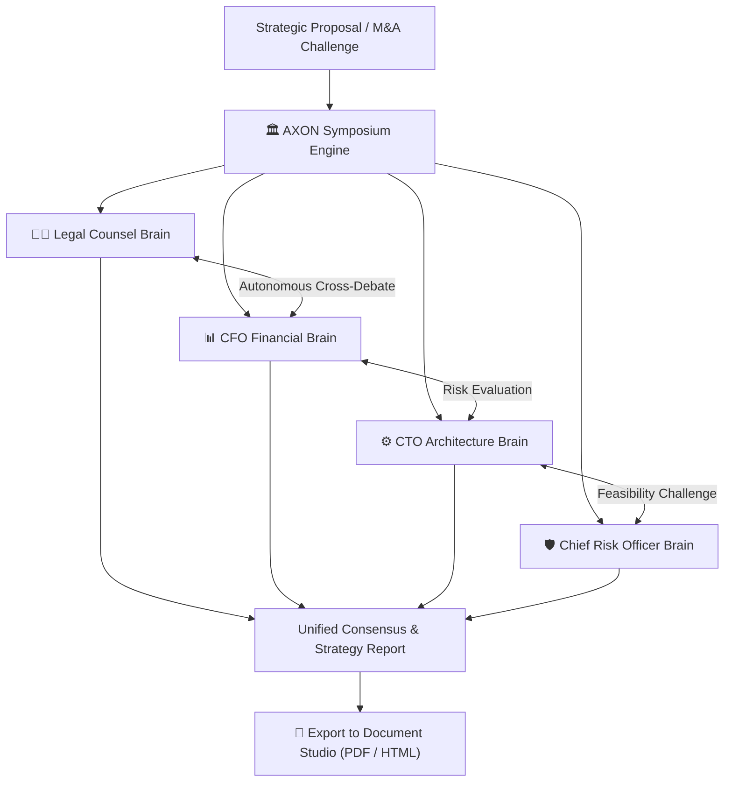

## Eliminating Bias with Multi-Agent Deliberation

Human decision-making in high-stakes environments often suffers from subjective bias, emotional blind spots, and groupthink.

**AXON Symposium** solves this by autonomously convening a panel of specialized AI expert Brains (e.g., *Chief Legal Counsel, Chief Financial Officer, VP of Engineering, Risk Officer*) to debate a single strategic challenge, cross-examine assumptions, and synthesize a unified, objective consensus report.

