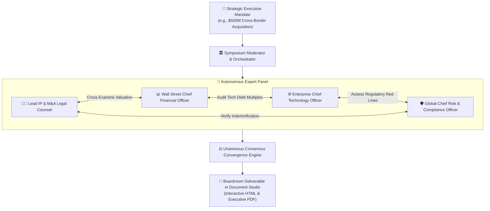

## Eliminating Bias Through Multi-Agent Deliberation

High-stakes corporate decisions—such as billion-dollar acquisitions, patent litigation strategies, and regulatory filings—are vulnerable to executive confirmation bias, departmental silos, and cognitive blind spots. Single-prompt AI chatbots only amplify this risk by delivering agreeable, sycophantic responses.

**AXON Symposium** introduces the enterprise standard for **Autonomous Multi-Agent Deliberation**. Instead of querying a single AI, you convene an autonomous panel of 2 to 6 tailored Stakeholder Domain Brains plus an automated Neutral Moderator / Devil's Advocate to debate a strategic mandate, aggressively cross-examine each other's assumptions, and converge on an objective consensus deliverable.

---

## 4 Core Pillars of AXON Symposium

<CardGroup cols={2}>
  <Card title="Multi-Perspective Synthesis" icon="users">
    Seat diverse domain brains with conflicting mandates (e.g., aggressive revenue growth vs. strict regulatory compliance) to expose hidden tradeoffs.
  </Card>
  <Card title="Aggressive Cross-Examination" icon="swords">
    Agents do not merely agree; they actively critique counter-arguments, audit spreadsheet formulas, and cite conflicting legal precedents.
  </Card>
  <Card title="3D Communication Graph & Timeline" icon="cubes">
    Observe the live deliberation in real time via an interactive 3D force-directed vector graph and step-by-step turn sequence.
  </Card>
  <Card title="Unanimous Consensus Reports" icon="file-signature">
    The debate concludes with a synthesized boardroom deliverable outlining agreed positions, remaining risks, and actionable recommendations.
  </Card>
</CardGroup>

---

## The 4-Phase Autonomous Debate Lifecycle

Every Symposium session progresses through 4 deterministic deliberation phases:

<Steps>
  <Step title="Phase 1: Panel Assembly & Mandate Ingestion">
    The user submits a strategic mandate or attaches data files; the L1 Architect autonomously generates tailored stakeholder Brains or the user seats custom Brains, attaches relevant data files (financial models, patent PDFs), and submits the core strategic mandate.
  </Step>

  <Step title="Phase 2: Independent Opening Statements">
    Each expert agent independently reviews the evidence from their domain perspective, establishing initial positions and identifying primary opportunities and risks.
  </Step>

  <Step title="Phase 3: Multi-Round Cross-Vetting & Rebuttal">
    Agents enter structured debate rounds:
    * The **CFO** challenges the **CTO's** cloud infrastructure timeline.
    * The **Legal Counsel** highlights indemnification gaps in the **CFO's** proposed contract structure.
    * The **Risk Officer** stress-tests worst-case macroeconomic scenarios using live FRED data.
  </Step>

  <Step title="Phase 4: Consensus Synthesis & Document Studio Export">
    The moderator reconciles conflicting arguments, calculates consensus scores, and compiles an executive boardroom report ready for one-click HTML/PDF download.
  </Step>
</Steps>

---

## Concrete "Aha!" Scenario: Evaluating an AI Startup Acquisition

> **Executive Mandate**: *"Evaluate our proposed $120M acquisition of a generative AI healthcare startup. Are the patent claims defensible, is the valuation multiple justifiable, and what are the HIPAA compliance liabilities?"*

1. **Panel Seated**: *Healthcare IP Litigator*, *HealthTech M&A CFO*, *Cloud HIPAA Compliance Officer*, *Chief AI Architect*.
2. **Autonomous Debate**: The IP Litigator identifies prior-art vulnerabilities in the startup's core patent; the CFO adjusts the DCF discount rate upward by 350 bps; the HIPAA Officer discovers unencrypted patient data staging risks in the architecture.
3. **Consensus Outcome**: The panel votes unanimously to proceed only under a revised $85M milestone-based earnout structure with mandatory escrow indemnification.

---

## Explore the Symposium Sub-Chapters

<CardGroup cols={3}>
  <Card title="Assembling the Expert Panel" icon="user-plus" href="/symposium/summoning-expert-panel">
    Learn how to select and seat custom Brains on your debate panel.
  </Card>
  <Card title="Autonomous Debate & Cross-Vetting" icon="arrows-split-up-and-left" href="/symposium/autonomous-debate-flow">
    Understand how agents challenge assumptions across multiple debate rounds.
  </Card>
  <Card title="Consensus Report & Document Studio" icon="file-export" href="/symposium/consensus-report-export">
    Export synthesized consensus reports to standalone HTML and executive PDFs.
  </Card>
</CardGroup>
