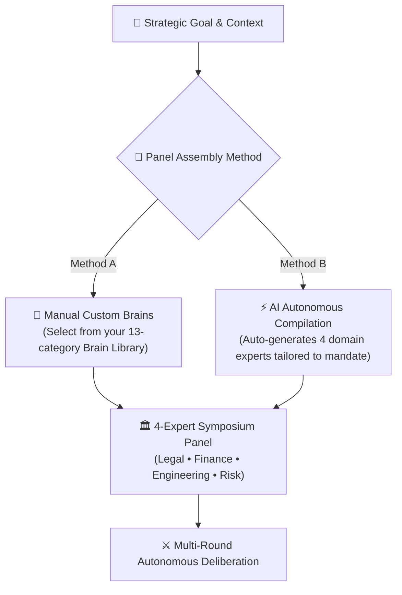

## Seating the Deliberation Panel

A successful boardroom debate requires balanced domain representation. AXON Symposium gives you the flexibility to assemble your expert panel through two distinct workflows:

---

## 2 Panel Assembly Methods

<CardGroup cols={2}>
  <Card title="💼 Custom Brain Selection (Pro Method)" icon="user-gear">
    **Direct Organizational Grounding**
    Hand-pick up to 4 custom Brains from your proprietary library (e.g., *Your Company's M&A Counsel*, *Internal Tax Lead*, *Product VP*). Each brain brings its bound reference PDFs and strict red-line guardrails to the table.
  </Card>
  <Card title="⚡ AI Autonomous Compilation" icon="wand-magic-sparkles">
    **Zero-Setup Dynamic Generation**
    Simply enter a strategic mandate. Symposium analyzes the topic and autonomously synthesizes 4 perfectly tailored expert personas with orthogonal mandates and cognitive heuristics in seconds.
  </Card>
</CardGroup>

---

## Step-by-Step Panel Configuration

<Steps>
  <Step title="Define Strategic Mandate & Attach Data Files">
    Enter your high-level business challenge in the central prompt area. Attach up to 10 multimodal files (financial models, patent vector PDFs, audit reports) to provide shared empirical evidence for all panelists.
  </Step>

  <Step title="Assign Panel Seats (Up to 4 Experts)">
    In the **Symposium Right Tools Panel**, configure seats 1 through 4:
    * **Seat 1 (Legal / Regulatory)**: Specialized in IP litigation, contract liabilities, or antitrust compliance.
    * **Seat 2 (Finance / Economics)**: Focused on valuation multiples, DCF modeling, and capital allocation.
    * **Seat 3 (Technology / Operations)**: Dedicated to technical debt, architecture scalability, and execution feasibility.
    * **Seat 4 (Risk / Governance)**: Tasked with stress-testing edge cases, compliance risks, and market volatility.
  </Step>

  <Step title="Select Debate Language & Mode">
    Configure the deliberation language (**English**, **Korean**, or **Chinese**) and select reasoning mode (**Flash Debate** for rapid high-level alignment vs. **Deep Deliberation** for exhaustive cross-examination).
  </Step>

  <Step title="Launch the Deliberation">
    Click **Start Debate** to seat the panel and initiate Round 1 opening statements.
  </Step>
</Steps>

---

## Panel Composition Best Practices

To extract the highest cognitive value from Symposium, structure your panel with intentionally orthogonal priorities:

| Panel Archetype | Primary Mandate | Counter-Perspective Role |
| :--- | :--- | :--- |
| **The Growth Champion (e.g., VP Strategy)** | Maximize revenue, market share, and competitive velocity | Pushes aggressive expansion and acquisition timelines |
| **The Fiduciary Skeptic (e.g., CFO)** | Capital efficiency, payback periods, and margin preservation | Audits financial assumptions and challenges ROI projections |
| **The Legal Shield (e.g., General Counsel)** | Zero regulatory liability, IP defense, and contract protection | Flags antitrust hurdles, patent risks, and compliance bans |
| **The Operational Realist (e.g., VP Engineering)** | Delivery feasibility, tech debt, and resource bottlenecks | Evaluates technical feasibility and realistic delivery timelines |

---

## Next Steps

<CardGroup cols={2}>
  <Card title="Autonomous Debate & Cross-Vetting" icon="arrows-split-up-and-left" href="/symposium/autonomous-debate-flow">
    Learn how agents cross-examine assumptions across multiple structured debate rounds.
  </Card>
  <Card title="Consensus Report & Document Studio" icon="file-export" href="/symposium/consensus-report-export">
    See how final debate outcomes are synthesized into boardroom deliverables.
  </Card>
</CardGroup>
