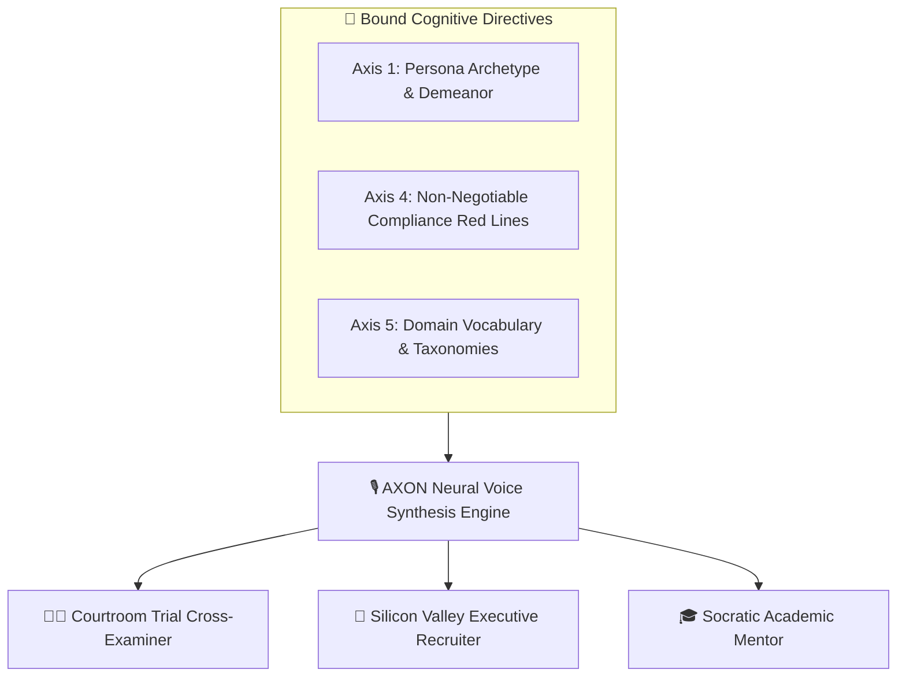

## Embodied Vocal Persona Architecture

When you select a Brain in AXON Talk, the voice synthesis pipeline does not merely change voice pitch—it inherits the **entire 6-Axis Cognitive Architecture** of that Brain. The AI adopts the professional posture, technical vocabulary, argumentative pacing, and non-negotiable guardrails of your chosen domain expert:

---

## 3 Production Enterprise Persona Archetypes

<CardGroup cols={3}>
  <Card title="Executive Mock Interviewer" icon="briefcase">
    **High-Pressure Behavioral & Technical Sparring**
    Simulates grueling C-suite and Silicon Valley engineering interviews. Asks incisive follow-up questions, challenges vague answers, and scores responses.
  </Card>
  <Card title="Courtroom Cross-Examiner" icon="gavel">
    **Trial Rehearsal & Deposition Prep**
    Assumes the hostile posture of opposing litigation counsel. Attacks weak assertions, traps witnesses in contradictory statements, and hones courtroom composure.
  </Card>
  <Card title="Socratic Academic Tutor" icon="graduation-cap">
    **Inquiry-Based Personalized Learning**
    Never simply recites textbook answers. Guides learners through progressive, stimulating questions to build deep conceptual understanding from first principles.
  </Card>
</CardGroup>

---

## Concrete Persona Sparring Scenarios

<AccordionGroup>
  <Accordion title="1. High-Stakes Legal Deposition Sparring" icon="scale-balanced">
    > **User**: *"Let's rehearse my cross-examination for the patent infringement hearing tomorrow."*
    > 
    > **Embodied Litigator Voice**: *"Understood. State your full name and position at Nexus BioTech for the record... Doctor, in Exhibit 4B, you claim the vector enzyme was discovered in March 2024. Why, then, does the laboratory ledger show no recorded synthesis until July? Explain that discrepancy."*
  </Accordion>

  <Accordion title="2. C-Suite Executive Recruiter" icon="user-tie">
    > **User**: *"Interview me for the Chief Revenue Officer role at an enterprise SaaS company."*
    > 
    > **Embodied Recruiter Voice**: *"Welcome. In your previous role, you achieved a 120% net retention rate. Walk me through a specific quarter where enterprise churn spiked, and detail the exact tactical intervention you deployed to reverse it."*
  </Accordion>

  <Accordion title="3. Socratic Machine Learning Mentor" icon="brain-circuit">
    > **User**: *"Why does self-attention scale quadratically with sequence length?"*
    > 
    > **Embodied Socratic Mentor Voice**: *"Let's explore that together. When calculating the attention score for a single token, how many other tokens in the sequence must it compare itself against? And what happens when every token performs that same comparison simultaneously?"*
  </Accordion>
</AccordionGroup>

---

## Seamless Voice-to-Transcript Continuity

Every spoken sparring session is simultaneously recorded and transcribed into structured Markdown:

* **Real-Time Performance Feedback**: Ask the Brain at the conclusion of the session: *"Analyze my verbal performance and provide a 3-point scorecard on clarity, conciseness, and defensive posture."*
* **One-Click Export**: Immediately export the spoken dialogue and feedback report to **Document Studio** for PDF printing.

---

## Next Steps

<CardGroup cols={2}>
  <Card title="Voice Models & Audio Latency" icon="waveform-lines" href="/talk/voice-customization">
    Learn how neural voice profiles and latency buffers optimize acoustic clarity.
  </Card>
  <Card title="Mobile & Hands-Free Scenarios" icon="car-side" href="/talk/mobile-handsfree-scenarios">
    Explore in-car executive briefings, language training, and walking brainstorming.
  </Card>
</CardGroup>
