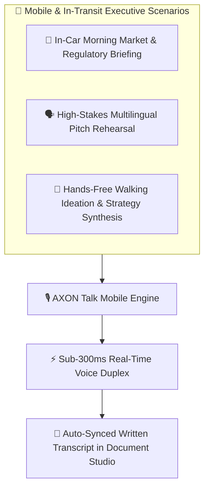

## Executive Mobility & Hands-Free Intelligence

Modern leaders spend substantial time in transit—commuting between client meetings, traveling internationally, or walking between campuses. Sitting in front of a keyboard is not always practical.

**AXON Talk** delivers a complete mobile-first voice experience, turning otherwise lost transit hours into high-yield strategic productivity:

---

## 3 Core Mobile & Hands-Free Use Cases

<CardGroup cols={3}>
  <Card title="1. In-Car Executive Briefings" icon="car">
    **Oral Summaries While Driving**
    Connect via Bluetooth to listen to synthesized verbal briefings on newly filed SEC 10-K disclosures, overnight global macro reports, or departmental email digests.
  </Card>
  <Card title="2. Multilingual Pitch Rehearsal" icon="earth-americas">
    **Accent & Fluency Sparring**
    Practice executive presentations in native English, Korean, or Chinese with an AI partner providing real-time pronunciation and phrasing corrections.
  </Card>
  <Card title="3. Walking Ideation & Structuring" icon="person-walking">
    **Voice-Driven Strategic Synthesis**
    Dictate unstructured thoughts while walking; the Brain organizes your spoken stream into structured executive bullet points on your synchronized cloud canvas.
  </Card>
</CardGroup>

---

## Mobile Ergonomics & Battery Efficiency

AXON Talk is built to excel under real-world mobile constraints:

* **Low-Power Audio Mode**: Minimizes GPU/CPU rendering on mobile devices, allowing extended 60+ minute continuous voice sessions without device overheating or battery drain.
* **Background Audio Continuation**: Operates seamlessly when your phone screen locks or when switching between mobile navigation and communication apps.
* **Bluetooth Headset & Car Audio Integration**: Supports standard AirPods, wireless headsets, and automotive hands-free systems with hardware button mute and resume.

---

## Concrete "Aha!" Scenario: 20-Minute Commute Boardroom Prep

> **Executive**: Managing Director commuting to a critical quarterly board meeting.

1. **8:15 AM (Connects in Car)**: Taps **AXON Talk** on mobile, selecting the **CFO Corporate Finance Brain**.
2. **8:17 AM (Spoken Query)**: *"Brief me on the three biggest variance drivers between our Q3 actuals and our revised FY2026 forecast."*
3. **8:19 AM (Oral Dialogue)**: The Brain verbally outlines a 12% increase in cloud hosting costs, asks if the executive wants a breakdown by business unit, and clarifies gross margin impact.
4. **8:35 AM (Arrival at Headquarters)**: The executive steps into the boardroom—the complete spoken Q&A is already formatted and saved in **Document Studio** on their iPad.

---

## Next Steps

<CardGroup cols={2}>
  <Card title="Live Data & Multimodal Vault" icon="database" href="/data/live-data-architecture">
    Explore how 41+ live APIs and multimodal file staging feed real-time intelligence into AXON Talk.
  </Card>
  <Card title="Document Studio & PDF Export" icon="file-pdf" href="/studio/document-viewer">
    Learn how spoken transcripts are converted into boardroom PDF reports.
  </Card>
</CardGroup>
