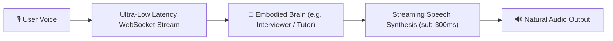

## Beyond Generic Voice Bots: Brain-Embodied Intelligence

**AXON Talk** is not a simple text-to-speech chatbot. It is a **living voice embodiment of any custom Brain**, delivering bi-directional, hands-free conversational intelligence over WebSocket with sub-300ms audio turnaround.

