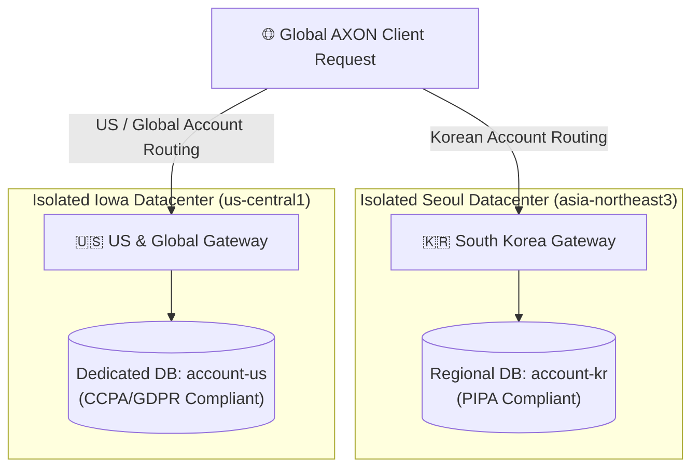

## Multi-Region Data Isolation Architecture

To comply with stringent international privacy laws, AXON enforces physical and logical database isolation across distinct regional datacenters:

<CardGroup cols={2}>
  <Card title="South Korea Region (PIPA Compliant)" icon="shield-halved">
    - **GCP Project**: `gosutox-account-prod`
    - **Regional Database**: `account-kr` (Seoul, `asia-northeast3`)
    - **Legal Framework**: Korean Personal Information Protection Act (PIPA)
    - **Boundary**: Zero cross-border data leakage or WAN replication
  </Card>
  <Card title="United States & Global (CCPA / GDPR)" icon="globe">
    - **GCP Project**: `gosutox-account-prod`
    - **Regional Database**: `account-us` (Iowa, `us-central1`)
    - **Legal Framework**: CCPA & European GDPR Data Residency
    - **Boundary**: Dedicated isolated database instance with strict regional pinning
  </Card>
</CardGroup>

User credentials, profile records, and conversation history are permanently pinned to the customer's selected home region.
