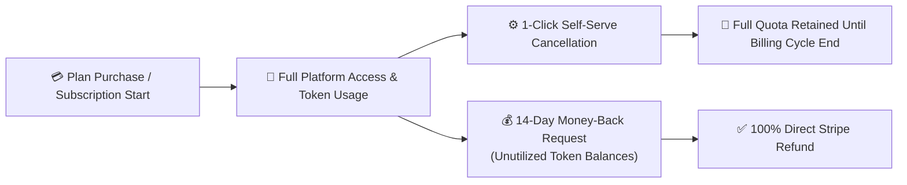

## Fair & Transparent Commercial Terms

At Gōsuto X, we stand behind the quality and operational value of AXON. We maintain clear, friction-free commercial policies with zero hidden cancellation penalties or trapped funds.

---

## 14-Day 100% Money-Back Guarantee

If you purchase an AXON subscription or one-time pass and find that it does not fit your workflow, you are eligible for a **100% full refund within 14 days of purchase**:

* **Eligibility**: Applicable to purchases where token balances remain substantially unutilized.
* **Processing**: Refunds are credited directly back to the original payment method via Stripe within 5 to 10 business days.
* **Frictionless Request**: Simply submit a refund request via the in-app **Support** drawer or email `support@gosutox.com`.

---

## Self-Serve 1-Click Cancellation

You maintain complete sovereignty over your subscription at all times:

<Steps>
  <Step title="Open Account Settings">
    Click your user avatar in the top-right corner and select **Account & Billing Settings**.
  </Step>

  <Step title="Navigate to Subscriptions">
    Under the **Billing & Invoices** tab, view your active plan tier, next renewal date, and payment method.
  </Step>

  <Step title="Click Cancel Subscription">
    Click **Cancel Subscription** and confirm. No mandatory retention phone calls or multi-page questionnaire barriers.
  </Step>
</Steps>

---

## Quota Retention Policy

When you cancel a recurring subscription:
* **No Immediate Account Freeze**: You retain 100% full access to your remaining token balance and active features until the **end of your current paid billing period**.
* **Zero Data Loss**: Your created Brains, conversation sessions, and Document Studio deliverables remain permanently intact and accessible in read/export mode.
* **Instant Reactivation**: You can reactivate your subscription at any time with a single click.

---

## Next Steps

<CardGroup cols={2}>
  <Card title="v1.0.0 Commercial Release Notes" icon="rocket" href="/changelog/v1.0.0">
    Review the full feature launch notes for the AXON Operating System.
  </Card>
  <Card title="Multi-Region Data Sovereignty" icon="shield-halved" href="/trust/data-sovereignty">
    Explore how AXON maintains strict PIPA and GDPR/CCPA data residency isolation.
  </Card>
</CardGroup>
