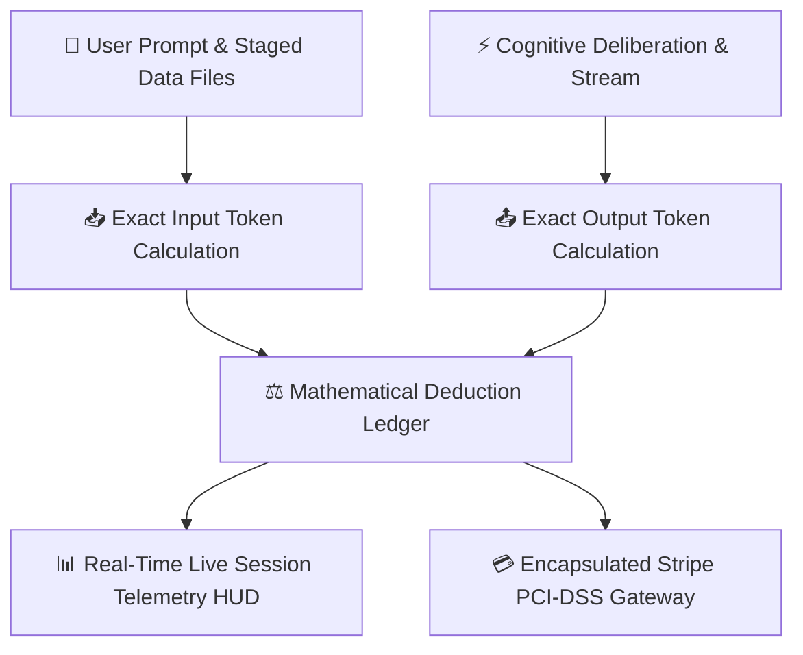

## 100% Mathematical Token Precision

In enterprise operations, unpredictable AI billing and hidden token markups create budget friction. AXON operates under a strict **Zero-Defect Mathematical Accounting Standard**—tokens are deducted with exact mathematical precision, zero arbitrary overhead, and zero token leakage.

---

## Subscription Plans & Pricing Tiers

AXON offers tailored pricing tiers designed for individual power users, enterprise executives, and corporate teams:

<CardGroup cols={3}>
  <Card title="Free Demo Pass" icon="gift">
    * **Cost**: $0 / Free
    * **Initial Grant**: 300,000 complimentary tokens
    * **Scope**: Access to Flash Mode, basic Brains, and standard Document Studio preview.
  </Card>
  <Card title="AXON E (Executive Pass)" icon="bolt">
    * **Cost**: $39.00 (One-Time Purchase)
    * **Scope**: Full access to AXON Agent, Symposium debates, CoWorX channels, and Document Studio exports.
  </Card>
  <Card title="AXON X / AXON S (Enterprise)" icon="crown">
    * **Cost**: Custom Recurring Subscriptions
    * **Scope**: Unlimited high-throughput tokens, custom Brain creator wizard, dedicated account management, and SLA guarantees.
  </Card>
</CardGroup>

---

## Dynamic Database-Driven ABAC Quota Engine

Plan allowances, token credits, storage limits, and module access permissions are **never hardcoded in application code**. All limits are resolved dynamically from centralized platform database rules with real-time caching:

| Quota Dimension | Free Demo | AXON E | AXON X / S |
| :--- | :--- | :--- | :--- |
| **Token Balance** | 300,000 tokens | 5,000,000 tokens | Scalable High-Volume Pool |
| **Reasoning Modes** | Flash Mode | Flash & Think Mode | Flash & Think Mode (Unbounded) |
| **Simultaneous Files** | Up to 3 files | Up to 10 files per turn | Up to 10 files per turn |
| **Custom Brains** | Read-only curated | Up to 10 Personal Brains | Unlimited Enterprise Brains |
| **Symposium Panels** | 2-Expert preview | Up to 4-Expert panels | Up to 4-Expert panels |
| **PDF & HTML Export** | Basic preview | Full Standalone HTML & PDF | Full Standalone HTML & PDF |

---

## Encapsulated Stripe Billing Security

All financial transactions, recurring billing cycles, and credit card data are managed with maximum security:

* **PCI-DSS Level 1 Encapsulation**: All Stripe secret keys, webhook handlers, and payment methods reside strictly within the dedicated identity and billing service. No other platform microservice holds payment credentials.
* **Transaction Separation**: One-time purchases (`AXON E`) strictly use `PaymentIntent.create()`, while recurring plans (`AXON X/S`) use `Subscription.create()`.
* **Safe Webhook Idempotency**: Stripe webhook listeners enforce cryptographic transaction ID deduplication to prevent duplicate billing or quota corruption.

---

## Next Steps

<CardGroup cols={2}>
  <Card title="Refund & Cancellation Policy" icon="credit-card" href="/trust/refund-and-cancellation">
    Review our 14-day 100% money-back guarantee and self-serve cancellation workflow.
  </Card>
  <Card title="v1.0.0 Commercial Release Notes" icon="rocket" href="/changelog/v1.0.0">
    Explore the full launch changelog for the AXON Operating System.
  </Card>
</CardGroup>
